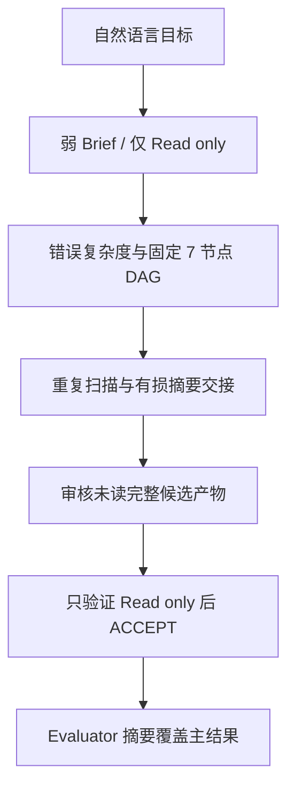
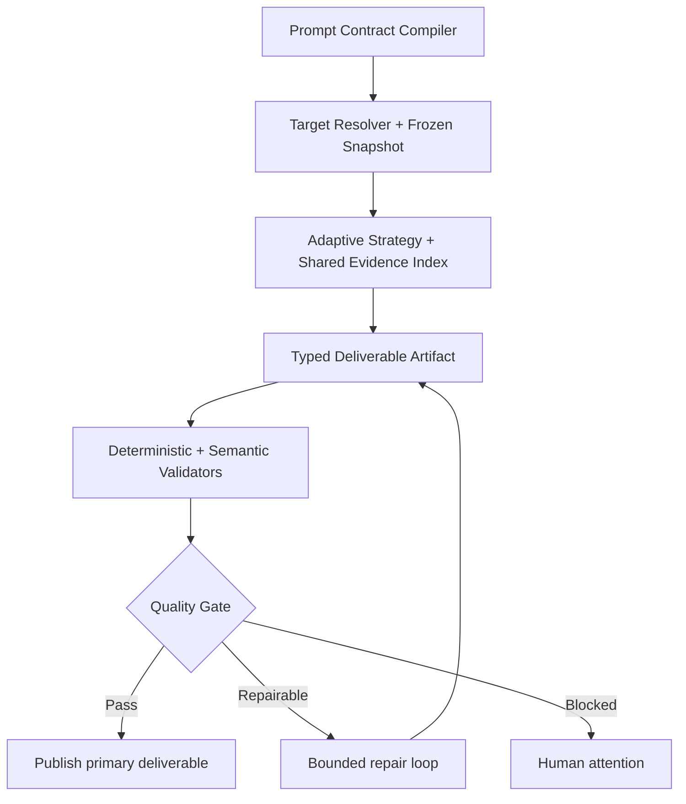
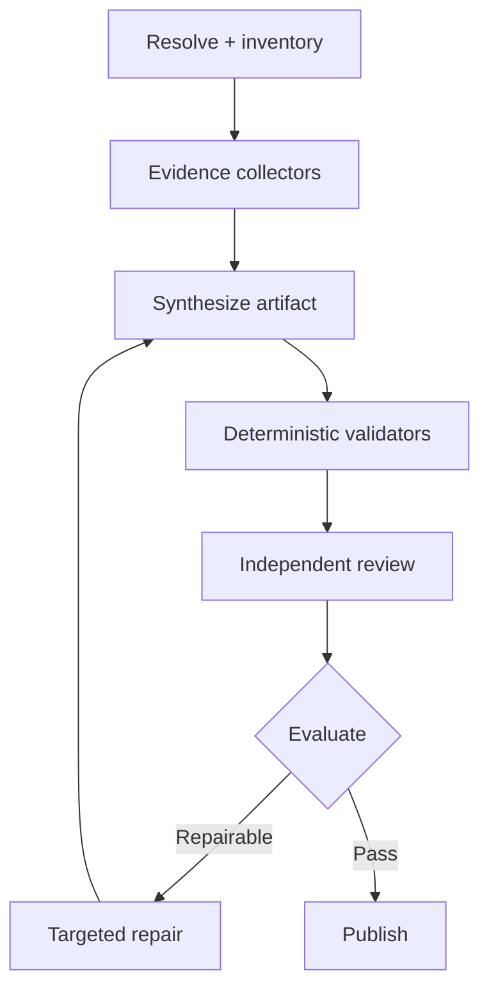
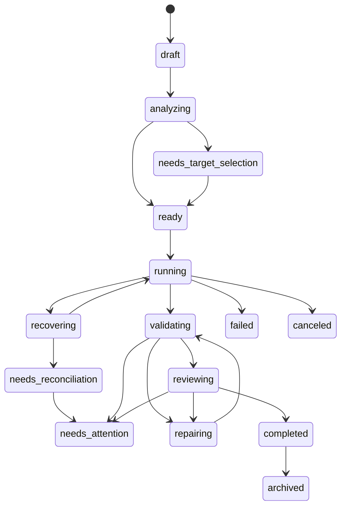

# OpenWorker Task Quality V2 — 端到端详细实施规格说明书

文档版本：1.0\
日期：2026-08-18\
目标仓库：`FBAMBOO/OpenWoker_FB`\
代码审计基线：`main@8df02f973d2961e47bd81baac10b4b77b0f85060`\
实施对象：OpenWorker Orchestration / Task 执行、验收、产物与 UI 全链路
规范级别：交付给 Codex 的实现依据；文中的 MUST / SHOULD / MAY 分别表示必须、建议、可选。

---

## 文档状态与证据边界

本规格基于三组只读证据：

1. GitHub 仓库 `FBAMBOO/OpenWoker_FB` 当前 `main`，审计提交为 `8df02f9`。
2. 用户提供的高质量基准报告 `fabric_dbt_architecture_report_2026-08-18.md`。
3. 用户提供的 OpenWorker 完整导出 `Test12_full_export_20260818_171609.zip`。

时间边界必须特别说明：Test12 于 `2026-08-18T09:16:09Z` 导出，即本地 `17:16:09 +08:00`；当前主线的大型修复提交 `4205d44` 在 `17:45:28 +08:00`，PR 合并提交 `8df02f9` 在 `18:37:24 +08:00`。因此下文把问题分成三类：

- **样本已证实**：Test12 的不可变导出足以证明。
- **当前 main 仍存在**：在 `8df02f9` 上仍可定位到实现根因。
- **当前 main 已有补丁但未闭环**：代码新增了机制，但 Test12 的黑盒行为或当前默认配置表明仍须实现/回归。

本文不把“报告更长”当作质量目标。篇幅和引用数只用于同仓库对照；最终门槛是覆盖完整、基线正确、证据可解析、推理受证据支持、限制诚实且验收可重复。

---

## 0. 执行摘要

### 0.1 结论

Test12 的差距不是 `gpt-5.6-sol@max` 本身能力不足，也不能靠再加 Reviewer 或把 Prompt 写长解决。根因是 OpenWorker 当前优化的是**多代理控制面的可靠完成**，而不是**任务结果的语义质量闭环**：



需要实现的不是 Prompt Patch，而是一个 **Task Quality Engine（TQE）**：



### 0.2 Test12 与 gold baseline 的可复核差异

| 指标 | Codex gold baseline | Test12 最终报告 | 结论 |
|---|---:|---:|---|
| 文件大小 | 24,883 bytes | 9,119 bytes | Test12 仅为 36.6%；长度不是门槛，但反映信息被压缩 |
| 行数 | 739 | 50 | Test12 把大段内容压进 7 个长段落 |
| H2 / H3 | 16 / 36 | 7 / 0 | 缺少可审计的分解层次 |
| 表格 | 8 | 0 | 资源、风险、部署矩阵未结构化 |
| 七个必需架构域 | 7/7，逐域深入 | 7/7，浅覆盖 | “提到”不等于“分析充分” |
| 实际证据引用 | 65 次、37 个不同文件，64 次带行号 | 有文件引用，但固定 SHA、机器清单和关系覆盖不足 | gold 的优势是证据链，不是文风 |
| 风险 | 3 高 + 7 中，并给 9 项验证优先级 | 无正式风险分级或行动排序 | 缺少架构决策价值 |
| 固定分析基线 | 说明 `origin/main`、commit、旧 checkout 与方法 | 分析当前旧功能分支/本地旧 `stg-main` | 分析对象不同，是最大偏差 |
| models / macros / tests / seeds / pipeline YAML | 228 / 52 / 42 / 5 / 15 | 205 / 39 / 30 / 3 / 57 | 分别少 10.1%、25%、28.6%、40%；部署拓扑完全错位 |
| 总运行成本 | 单 Codex agent，导出未给相同计量口径 | 12,169,074 tokens、369 tools、约 31.62 分钟 | 多代理成本高，但未转化为质量 |

gold baseline 的综合审计评分为 **93/100**。它最值得产品化的特征是：先锁定 ref/commit，再盘点资源；同时解释组件关系与控制面；提供跨层 lineage；检查 negative evidence；区分静态推断与运行事实；最后列风险、限制和下一步。V2 必须把这些方法转为通用质量合同与验证器，而不是硬编码 Fabric/dbt 答案。

### 0.3 Test12 执行事实

| 阶段 | 模型 / effort | Tokens | Tool calls | Wall seconds |
|---|---|---:|---:|---:|
| understand | Codex `gpt-5.6-sol@max` | 26,766 | 1 | 27 |
| explore | Codex `gpt-5.6-sol@max` | 6,558,556 | 130 | 533 |
| plan | Codex `gpt-5.6-sol@max` | 43,052 | 1 | 106 |
| execute | Codex `gpt-5.6-sol@max` | 5,459,725 | 101 | 476 |
| review | Claude Opus 5 high | 27,902 | 61 | 404 |
| test | Claude Opus 5 max | 34,727 | 51 | 469 |
| evaluate | Claude Opus 5 max | 18,346 | 24 | 253 |
| **合计** | 7 runs | **12,169,074** | **369** | **2,268 累计** |

探索与执行两个阶段占 98.76% tokens，并重复访问 58 个完全相同的路径；其路径集合 Jaccard 为 0.475。真正的 `explore + execute` 串行占总 elapsed 53.8%，其余近 46% 等待花在理解、规划与验收元流程上，而验收既没有完整读取候选，也只验了 `Read only`。

导出还显示 `context_refs=0`、`comments=0`、`relations=0`、`result_questions=0`。因此这次运行虽然有 7 个角色，却没有形成可查询的共享证据或真实任务协作，主要是隔离的串行接力。当前 TCHP acceptance matrix 的 247 个 orchestration tests 与 147 个 GUI tests 证明了协议、隔离、恢复和 UI 结构，但没有覆盖“同一 Prompt 的报告是否达到 gold-quality”这一语义问题。

### 0.4 根因与优先级

| ID | 级别 | 根因 | 证据与当前状态 | V2 决策 |
|---|---|---|---|---|
| RC-01 | P0 | 自然语言目标没有编译成语义质量合同 | Test12 Brief 唯一 criterion 是 `Read only`；当前 UI 在无输入时只生成泛化 criterion，见 `OrchestrationSurface.tsx:1122-1193` | 新增 Contract Compiler；自动派生覆盖、交付物、证据与验证条件 |
| RC-02 | P0 | 仓库根与权威 ref 未解析、未冻结 | Test12 在约 101 个 sibling worktree 的 workspace 中选择旧 checkout；gold 明确切到 `origin/main` Git objects | 新增 Target Resolver 与 `RepositorySnapshot`；任务开始前冻结 root/ref/SHA/manifest |
| RC-03 | P0 | Published Brief 与实际结果 schema 不一致 | Brief 要求 `criterion_results/work_products/risks`，runtime schema 输出 `criteria/files_touched/checks/remaining_risks`；API 聚合静默得到空字段 | 统一 canonical result schema；settlement 前严格校验；仅兼容适配器可转换旧版本 |
| RC-04 | P0 | 下游只收到被截断的 Work Product summary | reviewer/tester 的候选在第 2 节中途截断；当前 envelope 只内联 `summary`，见 `envelope.py:100-118,232-259` | 完整产物进入 task artifact store；按 hash/range lazy read；读不完整不能 PASS |
| RC-05 | P0 | findings 没有成为 gate 输入 | reviewer/tester 把问题塞在 summary/remaining_risks，verifier `findings=[]`；evaluator 仍按唯一 criterion ACCEPT | 标准化 `Finding[]`；硬性发现直接阻断；质量分与 criteria 均须通过 |
| RC-06 | P0 | 没有返修闭环 | 当前图为 `execute -> review/test -> evaluate`，无 repair edge，见 `service.py:5296-5304` | 实现最多 2 次、基于 findings delta 的 bounded repair loop |
| RC-07 | P0 | 显示的预算与有效预算脱节 | Test12 task metadata 为 1M/100，但 API `runtime_budget_mode=unlimited`；当前 server manager 仍显式 `enforce_runtime_budgets=False`，见 `manager.py:191-197` | 预算模式显式化；默认 hard profile；根 ledger + 分阶段 allocation；超限不能 completed |
| RC-08 | P1 | 认知复杂度与操作风险混为一谈 | `_assessment()` 主要看 Prompt 长度和手工 criteria 数，见 `service.py:4643-4697`；大仓库只读任务被判 `trivial/20` | 分离 `cognitive_complexity`、`operational_risk`、`evidence_workload` |
| RC-09 | P1 | 固定七节点 DAG 不适应任务类型 | `codex-led-code-v1` 对只读分析也固定 understand/explore/plan/execute/review/test/evaluate | 新增 task archetype 与策略选择；分析任务共享一次 inventory，按证据域并行 |
| RC-10 | P1 | preset 无条件覆盖复杂度策略 | Test12 assessment 为 review/test false，但 preset 顶层为 true | 规定 precedence；UI 显示 effective policy 与来源 |
| RC-11 | P1 | 交接选取全部传递祖先，缺少输入绑定 | `_upstream_context()` 收集全部 ancestors；`service.py:6881-6928` 再选其所有产品 | edge-level `input_bindings`；只强制直接候选与必要证据，其他按需 |
| RC-12 | P1 | 通用 summary schema 把报告塞入单字符串 | `_result_schema()` 只有 `summary/status/criteria/...`，见 `subscription_runtime.py:1094-1128` | role/archetype-specific schemas；报告主体为 artifact，不再是 summary |
| RC-13 | P1 | read-only 把“不能改源码”错误扩展成“不能交付文件” | Test12 没有正式命名 Markdown 产物，最终报告由 exporter 还原 | 分离 `source_workspace_write` 与 `task_artifact_write`；只读任务允许不可变交付物 |
| RC-14 | P1 | Codex 上下文与工具能力被过度削弱 | 同一 `_prompt(context)` 同时作为 developer 与 user；project docs、skills、workspace dependencies 等禁用，见 `subscription_runtime.py:2966-2991,3067-3082` | 拆分稳定开发者规则与一次性任务 envelope；受控加载 repo instructions；提供高效只读 repo tools |
| RC-15 | P1 | 最终聚合把 verdict 当成 deliverable | Test12 API 的 task result summary 被 evaluator “Recommendation: ACCEPT”替代；架构报告藏在 Work Product | TaskDetail 分离 `primary_deliverable`、`quality_verdict`、`run_summary` |
| RC-16 | P2 | 测试覆盖“协议正确”而非“任务好不好” | 当前 acceptance matrix 强调迁移、隔离、提示长度、安全和 UI；无 gold semantic benchmark | 增加 benchmark harness、质量评分、回归 corpus 与 shadow comparison |

### 0.5 当前 main 的修复边界

当前 `main` 已加入结构化 Brief、ContextRef、Work Product、runtime budget 检查代码和 prompt fair-share，这些是正确底座。但仍有以下未闭环点：

- 默认服务器配置仍关闭 runtime budget enforcement。
- Work Product 有 metadata/index，却没有 Agent 可调用的完整 artifact reader；`runtime_tools.py:365-376` 返回工具清单中不存在 `read_work_product_artifact`。
- fair-share 只让更多摘要露出，不会让 Reviewer 读到完整候选。
- envelope 初始 Brief 仅含 objective、criteria、deliverables；background、scope、instructions、constraints、non-goals 需 Agent 主动调 `get_task_context()` 才能看到。
- 固定 DAG、弱质量合同、错误基线、无 repair loop、主结果聚合错误仍未解决。
- 当前 TCHP 验收矩阵证明的是 durable handoff 的结构可靠性，不能替代端到端任务质量测试。

---

# 1. 目标与范围

## 1.1 业务目标

### G-01：同一自然语言 Prompt 自动形成可执行质量合同

用户只提供类似“只读分析当前 Fabric/dbt 项目的整体架构……”的目标时，系统 MUST 自动识别：

- `只读` 是源 workspace 权限约束；
- `当前项目` 需要 repo/root/ref 解析；
- 交付物是可下载 Markdown 架构报告；
- 必需覆盖入口、models、macros、tests、seeds、snapshots、部署配置七域；
- “之间的关系”要求至少一条跨三层 lineage 与执行控制链；
- “带文件证据”要求固定 snapshot 上可解析的路径和行号；
- 报告必须声明静态分析边界与未验证项。

系统不得把这些要求退化为一个 `Read only` criterion。

### G-02：先确认分析对象，再消耗模型预算

在任何高成本 Agent 运行前，系统 MUST 解析 workspace 中的 Git repo/worktree、候选项目根、HEAD、default branch、local/remote-tracking refs、dirty state 和重复副本，并产生不可变 `RepositorySnapshot`。

### G-03：让审核者审核完整、同一版本的候选产物

Reviewer、Tester、Evaluator MUST 以 `artifact_id + sha256` 指向同一候选版本。服务端必须从 run-bound ArtifactReadReceipt 派生 fresh 100% read completeness；任何读取不完整、hash 不匹配或读到别的上游摘要的验证结果都不得 PASS，不能信任模型自报。

### G-04：把发现转化为强制质量门禁与返修

结构化 findings、deterministic validators、semantic rubric 必须共同决定结果：

- 硬门禁失败：自动返修或 `needs_attention`；
- 可修复问题：生成最小 RepairRequest，最多 2 轮；
- 只有全部硬门禁通过且质量分达标时，才发布 primary deliverable。

### G-05：减少重复扫描和无效元流程

系统 MUST 只生成与任务 archetype 相匹配的 DAG，并共享一次 repo inventory/evidence index。纯分析任务不得让 Explorer 和 Worker 无理由重复全仓扫描。

### G-06：把主交付物与验收元数据分开

任务完成页、API 和导出中的主结果 MUST 是用户请求的交付物。Evaluator verdict 是旁路质量记录，绝不能覆盖报告正文。

## 1.2 可量化目标

以 Test12 脱敏离线 fixture 和同一 Prompt 为首个 benchmark：

| SLO | 目标 |
|---|---|
| 质量总分 | `>= 85/100`；任一 hard gate 失败则不得完成 |
| 必需域覆盖 | 入口、models、macros、tests、seeds、snapshots、deployment 为 7/7 |
| 引用解析率 | 100% 引用解析到冻结 SHA；P0/P1 claim 100% 有直接证据 |
| Reviewer 完整读取 | 候选 artifact 已读字节数等于 canonical artifact size，或逐 chunk coverage 100% |
| 错误基线率 | benchmark 中 0；生产中 `snapshot_confidence < 0.8` 必须显式假设或等待选择 |
| 重复扫描率 | 跨主要阶段相同 expensive query/path 的非缓存重复率 `<= 20%` |
| 成本 | Test12 benchmark 总 reported tokens `<= 3,000,000`、tool calls `<= 120`、elapsed `<= 20 min`；超过即按 budget policy 处理，不能静默完成 |
| 交付 | 生成命名 `.md` artifact；source workspace `git status` 前后相同 |
| 返修有效性 | 注入一个可修复 citation/coverage 缺陷后，2 轮内修复成功率 `>= 90%` |
| 聚合正确性 | `primary_deliverable`、`quality_verdict`、`run_summary` 三者不混写 |

成本目标是初始 benchmark profile，可按硬件和 provider 计量校准；质量 hard gates 不因成本调优而降低。

## 1.3 范围内

- Prompt Contract Compiler 与可编辑 Contract Preview。
- Workspace/repository/project/ref resolver 与不可变 snapshot。
- `repo_analysis` 等 task archetype、策略选择与动态/模板化 DAG。
- 一次生成、可复用的 Repository Inventory 与 Evidence Index。
- 角色特定 result schemas、artifact channel 和完整 artifact read API/tool。
- Claim/Evidence/Coverage/Inventory 数据模型。
- deterministic validators、semantic rubric、findings 和 repair loop。
- effective budget、根级 ledger、分阶段 allocation、软/硬/unlimited 模式。
- Create Task、Run Detail、Evidence Explorer、Deliverable Viewer、Repair 与 Benchmark UI。
- API、数据库迁移、权限、安全、可观测性和兼容迁移。
- Test12 benchmark 与通用 repository-analysis corpus。

## 1.4 范围外

- 训练或微调基础模型。
- 把 Fabric/dbt 业务答案硬编码到通用 orchestrator。
- 在本期构建完整 dbt parser/warehouse 运行时；V2 可提供可插拔 `dbt_static_inventory` adapter。
- 自动 fetch 网络远端 ref；默认仅使用已有 local Git objects。用户明确允许后才可 fetch。
- 代替 dbt/数据库执行来证明运行时数据正确性。
- 重写现有 WAL、lease/fencing、TCHP 安全底座；本规格在其上增量实现。
- 允许 Agent 读取私有 transcript 作为交接方式。

## 1.5 成功定义

功能完成必须同时满足：

1. 同一 Test12 Prompt 无需用户手工拆 criteria，也能形成正确 contract。
2. 分析基线被显式冻结且用户可见。
3. 产物是完整、可下载、带 hash 的 Markdown artifact。
4. 验证者能够完整读取并对相同 hash 评审。
5. 质量发现可阻断并触发返修，不再因“只读已通过”而接受内容缺陷。
6. 有效预算真实可见、真实生效、可审计。
7. benchmark 达到本节 SLO，且现有 orchestration 安全/可靠性回归不退化。

---

# 2. 用户角色和使用场景

## 2.1 人类用户角色

| 角色 | 主要目标 | 权限 |
|---|---|---|
| Task Author / Operator | 用自然语言创建任务、确认分析目标、查看并下载结果 | 创建、编辑未发布 Contract、选择 snapshot/strategy、启动、取消、请求返修 |
| Reviewer / Approver | 审阅报告与质量证据、决定是否接受人工例外 | 查看完整 artifact/evidence/finding；可接受、退回、在授权时 waiver |
| Maintainer / Admin | 配置 archetype、rubric、模型、预算和 rollout | 管理 quality profile、feature flags、provider policy；不能篡改历史 artifact |
| Benchmark Author | 维护离线 fixture、oracle、rubric 与回归阈值 | 创建 benchmark；读取脱敏结果；不能访问生产 secret |
| Auditor | 复核 snapshot、hash、执行、waiver 与权限事件 | 只读全部审计元数据，不默认读取敏感 artifact 正文 |

## 2.2 系统角色

系统角色是责任边界，不要求每个角色都启动一次大模型：

| 角色 | 可由确定性代码完成 | 可调用模型 | 核心输出 |
|---|---|---|---|
| Contract Compiler | schema、规则、source span、完整性检查 | 对隐含要求/任务类型分类 | `TaskContractDraft` |
| Target Resolver | Git/repo/worktree/ref/project 探测 | 仅在命名歧义时排序/解释 | `RepositorySnapshotCandidate[]` |
| Strategy Selector | policy/预算/复杂度计算 | 可提供建议，不拥有最终 policy | `ExecutionStrategy` |
| Surveyor | inventory、文件树、Git metadata、搜索缓存 | 可总结盘点 | `RepositoryInventory` |
| Domain Explorer | — | 按互斥证据域分析 | `EvidenceBundle` |
| Synthesizer / Producer | 模板和结构校验 | 写完整报告 | `DeliverableArtifactVersion` + `ClaimLedger` |
| Evidence Verifier | 路径、行号、hash、coverage、算术 | 检查“证据是否支持 claim” | `QualityEvaluation` + `Finding[]` |
| Independent Reviewer | — | 挑战推理、范围和不确定性 | `ReviewVerdict` |
| Evaluator | hard gate 聚合、阈值与 policy | 只处理语义冲突，不重写硬规则 | `FinalQualityDecision` |
| Repair Worker | 版本/patch 边界 | 按 RepairRequest 定点修复 | 新 artifact version；原版本不可变 |

## 2.3 权责原则

- Contract Compiler 可提出要求，用户或 deterministic policy 才能发布 contract。
- Agent 不得降低 hard gate、提高预算或切换 snapshot。
- Producer 不得自验最终通过。
- Reviewer/Tester 不得编辑候选 artifact；Repair Worker 输出新版本。
- Evaluator 不得把缺失 evidence 当作 pass，也不得把可疑 finding 从结构化字段藏进 summary。
- human waiver 必须独立记录，不修改原 verdict。

## 2.4 核心使用场景

### UC-01：仅输入自然语言，创建高质量只读架构报告

用户输入目标并选择 workspace。系统自动编译七域 coverage、证据、基线、格式和只读限制；解析主 repo/ref；显示 strategy 与成本；用户启动后获得 `.md` 交付物。

### UC-02：workspace 含多个 repo/worktree/旧副本

Resolver 识别候选、重复对象和 ref 新鲜度。若一个候选置信度 `>=0.8`，系统推荐并明确假设；否则进入 `needs_target_selection`，禁止直接大规模扫描。

### UC-03：用户明确要求 current checkout

Contract source span 与 target policy 记录该显式指令，Resolver 必须选 HEAD/working tree snapshot，不得自动换 `origin/main`。dirty files 进入 snapshot manifest，并标注非 commit 内容。

### UC-04：只读源码但需要生成报告文件

`source_workspace_write=false`，`task_artifact_write=true`。报告写入 task-owned immutable artifact store，不进入源码 workspace；完成后 source workspace 没有变化。

### UC-05：Reviewer 发现引用不支持结论

Reviewer 提交带 claim、artifact hash、severity、evidence 的 Finding。Gate 判为 `repairable`，创建 RepairRequest；Producer 只修相关章节，生成 v2；V2 首期 Reviewer 仍须重新读取 v2 全文并生成新的 read receipt。

### UC-06：预算接近上限

达到 80% 时 UI 警告，Agent 收到剩余预算。达到 hard limit 时设置 `budget_status=exhausted`、`workflow_status=needs_attention`、`reason_code=budget_exhausted`；如果已有部分 evidence 可保存则形成 checkpoint，用户可增加预算或收缩 scope 后 resume。不得把 partial report 标为 completed。

### UC-07：模型/工具故障后恢复

同一 snapshot、contract、artifact/evidence checkpoint 可重放；禁止在重试时偷偷改 ref、contract 或 budget mode。

### UC-08：管理员比较 V1 与 V2

Benchmark 页面用相同 snapshot/prompt 并行或离线运行 legacy 和 V2，展示质量、成本、耗时、引用解析率、重复扫描率和 repair 次数；不得只比较 token。

---

# 3. 页面清单与 UI 详细说明

## 3.1 信息架构

| 页面 / 区域 | 建议路由 | 主要组件 | 目的 |
|---|---|---|---|
| Task List / Dashboard | `/tasks` | `TaskQualitySummary`, `TaskRow` | 同时显示状态、主交付物、质量分、target 与预算 |
| New Task — Goal | `/tasks/new?step=goal` | `GoalStep` | 输入目标、workspace、权限边界 |
| Contract Preview | `/tasks/new?step=contract` | `ContractPreviewStep` | 审阅自动派生 requirements/criteria/deliverables |
| Target & Scope | `/tasks/new?step=target` | `TargetResolverStep` | 选择 repo/root/ref/SHA、排除重复 worktree |
| Strategy Preview | `/tasks/new?step=strategy` | `StrategyPreviewStep` | 查看 DAG、角色、预算、质量 gates 与来源 |
| Run Detail | `/tasks/{taskId}` | `TaskRunHeader`, tabs | 运行、状态、事件、预算和异常总览 |
| Evidence Explorer | `/tasks/{taskId}/evidence` | `CoverageMatrix`, `ClaimTable` | 按 claim/域/文件检查证据 |
| Deliverable Viewer | `/tasks/{taskId}/deliverables/{artifactId}` | `ArtifactViewer`, `ArtifactDiff` | 阅读、下载、比较完整产物版本 |
| Review & Repair | `/tasks/{taskId}/quality` | `QualityGatePanel`, `FindingList` | 查看评分、硬门禁、findings 和修复 |
| Benchmarks | `/settings/task-quality/benchmarks` | `BenchmarkRuns`, `ScoreTrend` | 运行和比较回归 corpus |
| Quality Settings | `/settings/task-quality` | `ArchetypeSettings`, `RubricEditor`, `BudgetProfiles` | 管理默认策略与 rollout |

## 3.2 Task List / Dashboard

每行 MUST 显示：

- title；
- task archetype；
- workflow status 与 quality status，二者分列；
- primary deliverable 类型/版本；
- target：repo 名、short SHA、dirty 标志；
- quality score 与 hard-gate 状态；
- effective budget mode、已用百分比；
- started/updated 时间；
- attention reason。

禁止仅显示 `completed` 而隐藏 `quality=waived`、`budget=unlimited` 或 `artifact=unverified`。

筛选项：`workflow_status`、`quality_status`、`archetype`、`repo`、`snapshot_ref`、`budget_mode`、`has_waiver`、`repair_count`、`created_by`。

行操作：Open、Download primary deliverable、Resume、Request repair、Cancel、Archive。只有授权角色可 Waive。

## 3.3 New Task — Step 1：Goal

字段：

| 字段 | 类型 | 规则 |
|---|---|---|
| Title | text，可空 | 空时从 objective 生成，不参与质量判断 |
| Objective | large textarea，必填 | 保留原文与 hash，不在前端拆句后丢失 |
| Workspace | path picker，代码任务必填 | 只提交 canonical path；前端不扫描 |
| Source workspace permission | `read-only` / `writable` | Prompt 中“不要修改”可作为建议，但必须让用户确认硬权限 |
| External/network access | off/on | 默认 off；显示原因和有效 policy |
| Quality profile | balanced / quality-first / custom | 默认 quality-first for repo analysis |

主按钮为 **Analyze goal**，而不是直接 Start。点击后调用 Contract + Target preflight。分析期间可取消，不产生模型执行 DAG。

## 3.4 Step 2：Contract Preview

页面分四栏或四个折叠区：

1. **Requirements**：每项显示文本、类别、hard/soft、来源（explicit/inferred/policy）、原 Prompt source span、confidence。
2. **Coverage Matrix**：例如入口、models、macros、tests、seeds、snapshots、deployment，显示 required evidence 与验证方法。
3. **Deliverables**：类型、文件名、MIME、必需章节、artifact channel。
4. **Constraints & Non-goals**：只读、网络、禁止运行命令、静态结论边界。

交互规则：

- 用户可编辑 inferred 项，不能无提示删除 policy hard gates。
- 删除 explicit requirement 时二次确认，并保留 audit event。
- 低置信度项显示黄色；冲突显示红色并禁止发布。
- “Reset from objective” 生成新 draft version，不覆盖旧 draft。
- 页面实时显示 `Contract completeness`；必需字段缺失时 Start 禁用。

Test12 Prompt 的默认 Contract Preview MUST 至少产生：

- 7 个 architecture coverage requirements；
- 1 个跨域关系/lineage requirement；
- 1 个 baseline/snapshot requirement；
- 1 个 file evidence/citation requirement；
- 1 个 limitations requirement；
- 1 个 `source workspace unchanged` constraint；
- 1 个 Markdown report deliverable。

## 3.5 Step 3：Target & Scope Resolver

顶部卡片显示推荐 target：

- workspace canonical path；
- repo root；
- project root；
- VCS type；
- current HEAD/branch；
- local default branch 与 remote-tracking default ref；
- ahead/behind/diverged；
- commit timestamp；
- dirty/untracked；
- detected sibling worktrees/duplicate project roots；
- ignored directories；
- estimated files/bytes；
- recommendation confidence 与理由。

候选表允许选择：Current working tree、Current HEAD、Local default branch、Local remote-tracking default ref、自定义本地 ref。选择后预览冻结 SHA 与 manifest hash。

规则：

- 默认不 fetch；“Refresh remote” 是独立、显式网络动作。
- 如果 objective 明说 branch/ref/current checkout，优先显式语义。
- 如果只说“当前项目”且 checkout 明显落后默认分支，推荐最新已有 local default-tracking ref，并清楚显示假设。
- dirty working tree 只能选 working-tree snapshot；引用必须含 blob hash，不能伪装成 commit permalink。
- 大量 duplicate worktrees 时默认只选一个 canonical root，其余列为 exclusions。

## 3.6 Step 4：Strategy Preview

显示：

- task archetype 与置信度；
- cognitive complexity、operational risk、evidence workload 三个独立分数；
- DAG 图；
- 每个 node 的职责、provider/model、输入 bindings、产物 schema；
- deterministic validators；
- repair 最大轮数；
- effective review/test policy 及来源；
- effective task/run budgets、mode、分配依据与预估成本；
- quality rubric 和 hard gates。

用户可选择系统给出的兼容策略，但不能在此绕过 hard gate。高级用户可修改预算、provider 或并发；修改后 MUST 重新运行 admission check。

Test12 类任务默认策略应为 `repo-analysis-v2`，而非通用 `codex-led-code-v1`。

## 3.7 Step 5：Publish & Start

最终预览同时展示不可变对象：

- original objective hash；
- Contract version/hash；
- Snapshot ID/SHA/manifest hash；
- Strategy version/hash；
- Quality profile/rubric version；
- Effective budget and mode；
- permission ceiling；
- expected primary deliverable filename。

按钮：Save draft、Publish contract、Publish & Start。发布后任何对象变化都创建新版本并要求 replan；不得原地修改运行中的 contract/snapshot。

## 3.8 Run Detail

Header 必须区分：

- workflow：running / waiting / repairing / completed / failed；
- quality：pending / pass / fail / waived；
- artifact：none / draft / validating / verified；
- budget：hard/soft/unlimited + used/limit；
- snapshot：ref@shortSHA。

Tabs：Overview、Plan、Contract、Target、Activity、Evidence、Deliverables、Quality、Budget、Audit。

Overview 默认显示 primary deliverable 卡片；不能默认把 evaluator summary 当结果。

## 3.9 Evidence Explorer

三个视图：

1. **Coverage**：requirement × status × supporting claims × files。
2. **Claims**：claim text、type、confidence、severity、evidence count、validator status。
3. **Files**：snapshot path、blob hash、引用行段、支持哪些 claims。

点击 citation 打开 snapshot file viewer，并高亮精确行段。negative claim 必须显示 search query、scope、exclusions 和执行时 snapshot hash。

## 3.10 Deliverable Viewer

功能：

- 流式/分页读取完整 artifact；
- 显示 filename、MIME、bytes、SHA-256、version、producer；
- Markdown render 与 raw 两种模式；
- 点击 citation 跳 Evidence Explorer；
- 下载；
- v1/v2 section-aware diff；
- 显示 Reviewer 已读覆盖度和 subject hash。

不可执行文件只下载、不自动打开。超大文件按 range 读取并验证 chunk hash/Merkle manifest。

## 3.11 Review & Repair

顶部显示 hard gates、rubric score、verdict 与 version。Finding 列表字段：severity、category、claim/section、message、evidence、suggested fix、blocking、status、source role。

操作：Request repair、Accept suggestion、Dismiss nonblocking、Escalate、Waive hard gate。Waive 必须输入 reason、ticket/reference，并由具备 `quality:waive` 的用户执行。

Repair preview 显示：被修章节、不可变原 artifact、预计预算、需要重跑的 validators/reviewers。默认只重跑受影响验证，但 citation/hash/inventory 等全局硬 gate 始终重跑。

## 3.12 Settings 与 Benchmark

Quality Settings：

- archetype classifiers 与模板版本；
- contract compiler policies；
- rubric versions；
- budget profiles；
- repair max attempts；
- target selection policy；
- feature flags；
- provider allowlist；
- controlled repo-instruction discovery。

Benchmark 详情展示：quality score、hard-gate failures、coverage、citation resolution、target correctness、tokens、tools、elapsed、duplicate-scan ratio、repair count、model/provider、snapshot 和版本差异。

---

# 4. 用户操作与交互行为

## 4.1 创建任务主流程

1. 用户输入 Objective、workspace 和权限边界。
2. 点击 **Analyze goal**。
3. 服务端立即创建 `workflow_status=draft` 的 `TaskRecord` 并分配最终 `task_id`；`TaskDraft` 只是这个 TaskRecord 的创建期 API/UI projection。随后调用 contract analysis 和 target preflight；二者可并行。
4. UI 展示 Contract Preview 与 target candidates。
5. 用户只需处理冲突或低置信度选择；高置信度结果可直接接受。
6. 系统生成 strategy，计算 effective policy/budget，执行 admission check。
7. 用户 Publish & Start。
8. 服务端在同一事务中把已发布 Contract、Snapshot、Strategy、Rubric 与 BudgetLedger 绑定为该 `task_id` 的 active versions，将状态改为 `running`，并产生首次 wake；Start 不再创建第二个 TaskRecord。

任何一步失败都保留 draft；不得创建一半发布、一半未发布的任务。

## 4.2 Contract Compiler 行为

### 4.2.1 输入

- original objective；
- title/domain/read-only/network 等显式 UI 字段；
- workspace preflight 的轻量 metadata；
-选定 quality profile；
- 可选用户提供 criteria/deliverables。

### 4.2.2 处理顺序

1. 规则引擎提取显式约束、交付物、格式、范围词和实体。
2. archetype classifier 分类任务。
3. archetype template 加入 invariant requirements。
4. 模型仅补全隐含关系、验证方法和不确定项。
5. semantic linter 检查 requirement 是否可验证、是否只描述权限却没有结果质量、是否互相冲突。
6. 生成 source-span 映射和 confidence。

### 4.2.3 合并优先级

`security policy hard gate > explicit UI permission > explicit objective > user custom criterion > archetype invariant > model inference > generic default`。

低优先级不得覆盖高优先级。冲突必须产生 `ContractConflict`，不得静默选择。

### 4.2.4 何时询问用户

- 只有会显著改变目标、成本或权限，且 resolver/compiler confidence `<0.8` 时询问。
- 可通过记录假设安全推进的事项不阻塞，例如静态分析未连接数据库。
- 权限提升、网络 fetch、waiver 和不可逆动作始终需要显式授权。

## 4.3 Target Resolver 行为

### 4.3.1 探测

Resolver 在模型启动前执行受控只读命令/库调用：

- canonicalize workspace；
- `git rev-parse --show-toplevel`；
- list worktrees；
- HEAD/branch/upstream/default refs；
- ahead/behind/diverged；
- ref commit times；
- dirty/untracked summary；
- project markers，例如 `dbt_project.yml`、`package.json`、`pyproject.toml`；
- directory/file counts 与 ignore rules；
- duplicate repo object IDs/project markers。

### 4.3.2 决策矩阵

| 条件 | 推荐 target | 行为 |
|---|---|---|
| Objective 明确某 ref/SHA | 指定 ref | 不自动替换；不存在则阻断 |
| 明确 current checkout/working tree | working tree snapshot | 记录 dirty blobs；不声称是 default branch |
| 只说“当前项目”，HEAD 与 default ref 同步 | HEAD | 记录两者一致 |
| 只说“当前项目”，HEAD 明显落后且 default ref 可用 | local default-tracking ref | 显示差异、置信度和假设；quality-first 可自动采用 |
| 多个同等项目根 | 无 | `needs_target_selection` |
| ref 在执行中移动 | 原冻结 SHA | 继续使用 SHA；UI 显示 ref moved，不改变结果 |
| dirty files 在目标范围 | working tree snapshot 或等待选择 | commit snapshot 不包含 dirty 内容，必须明确 |

### 4.3.3 冻结

Git commit snapshot 以 `vcs_object_format + commit_oid + root_tree_oid` 冻结；可用 `git ls-tree` 只读 object metadata 建 path/mode/object-id manifest，无需读取 50k 个文件正文。每个实际读取/引用的文件再记录 Git blob OID、SHA-256、size 与行索引，引用 resolver 始终从冻结 tree 读取。

Working-tree snapshot 使用不可变 overlay，而不是在执行中继续读 live workspace：

1. 记录 base `HEAD commit/root_tree_oid`；
2. 在 freeze 时把 staged、modified 和选定 untracked 文件正文复制到 task artifact store，记录 path/mode/size/SHA-256；
3. manifest 记录 deleted/renamed paths、index/worktree view 与明确 exclusions；
4. 未变化文件从 base tree 读取，变化文件只从 overlay artifact 读取；
5. 复制前后 stat/hash 不稳定则有限重试，仍变化则 snapshot freeze 失败。

因此大仓库 preflight 可以只看 metadata，而 working-tree dirty 内容仍被真正冻结。`read_snapshot_file/search_snapshot` 在 snapshot 发布后不得回读 live workspace。

Non-Git directory 使用 `snapshot_kind=directory`：freeze 阶段按 include/exclude/secret policy 遍历全部在范围文件，把正文复制进 content-addressed blob pack，并记录 path/mode/size/SHA-256/deletion-not-applicable。复制期间若文件变化则重试或失败。该操作可能昂贵，必须在 admission 中估算 files/bytes 和预算；preflight 可只读 metadata，但模型运行前必须完成全量 directory freeze。

## 4.4 Strategy Selector 行为

### 4.4.1 三轴评估

| 轴 | 输入 | 输出用途 |
|---|---|---|
| Cognitive complexity | 请求域数、跨组件关系、推理深度、歧义、交付结构 | 模型能力、综合阶段、是否需要独立 review |
| Operational risk | 源码写、外部写、secret、不可逆、网络 | 权限、human gates、安全 sandbox |
| Evidence workload | 文件数/bytes、项目数、所需证据域、图/清单规模、negative search | explorers 数、工具预算、缓存和并行度 |

只读会降低 operational risk，但不会降低 cognitive complexity/evidence workload。

### 4.4.2 archetype

首期支持：

- `repo_analysis`：架构、审计、只读调查；
- `code_change`：实现/修复；
- `focused_question`：窄范围问答；
- `document_generation`：基于指定来源生成文档；
- `incident_triage`：日志/错误/代码定位；
- `custom`：用户自定义 DAG。

### 4.4.3 policy precedence

有效 policy 的优先级：

1. security/permission hard ceiling；
2. explicit user requirements；
3. task archetype invariants；
4. risk/complexity/evidence assessment；
5. quality profile；
6. runtime preset defaults；
7. provider defaults。

Preset 只能提供默认拓扑/模型和上限，不能无条件把 trivial task 扩成七节点，也不能关闭 archetype hard gate。UI/API 均返回每个 effective 值的 `source`。

## 4.5 `repo-analysis-v2` 默认执行策略

### 4.5.1 图形



### 4.5.2 执行原则

- `Resolve + inventory` 是确定性阶段，不启动大模型。
- Evidence collectors 按互斥 coverage groups 分工；Test12 示例可分为：
  - project entry + models/DAG；
  - macros + materialization/lifecycle；
  - tests + seeds + snapshots；
  - profiles + pipelines + deployment/control plane。
- 小仓库可由一个 Explorer 完成所有 groups；中大仓库最多并发 4 个。
- Collectors 读取同一 snapshot 和共享 index，不互相复制完整 summary。
- Synthesizer 读取 typed EvidenceBundles 和必要源文件，默认不重新全仓扫描。
- deterministic validators 先运行；硬错误出现时无需先烧 Reviewer token。
- Independent Reviewer 读取完整 artifact，并可按 claim 读取证据。
- Evaluator 聚合，不再进行第 3 次全仓探索。

### 4.5.3 planner 的地位

`repo-analysis-v2` 不设置一个只能写 prose、不能改 DAG 的昂贵 Planner node。策略由 preflight 生成。如果启用模型 Planner，它必须输出可校验 `PlanProposal`，并在执行前由服务端编译、验证、冻结成 DAG；不能在 DAG 已冻结后表演式规划。

## 4.6 Evidence 收集与复用

### 4.6.1 Repository Inventory

Surveyor 一次生成：文件树、marker、分类计数、语言/extension、Git metadata、可选 dependency/ref/source graph、已知 generated/vendor paths。Inventory 是 immutable artifact，后续按 ID 读取。

### 4.6.2 Query Cache

所有高成本只读操作生成 query key：

`sha256(snapshot_id + tool + normalized_args + tool_version)`。

相同 key 默认复用结果；角色可因明确理由 bypass，并写入 audit。统计 duplicate-scan ratio 时，缓存命中不算重复扫描。

### 4.6.3 EvidenceBundle

Collector 必须输出 claims、evidence refs、非权威 coverage claims、inventory metrics、negative searches、open questions 和 limitations。不得只输出自由文本摘要；正式 `CoverageResult` 由 validator 生成。

## 4.7 生成交付物

Producer 输出顺序：

1. 先创建 task-owned artifact upload session。
2. 流式写 Markdown/body，不写 source workspace。
3. 完成后服务端计算 SHA-256、bytes、section index 和 citation index。
4. Producer 提交 typed result，只引用 `artifact_id/hash`，不在 `summary` 复制全文。
5. Settlement 校验 artifact 存在、hash/size/MIME/filename 与 contract 一致。

如果 artifact 创建失败，run 失败；不得退化成“把正文塞在 summary”。

## 4.8 完整验证与返修

Reviewer 在开始时绑定 candidate artifact version。读取方式：

- 小于 inline/read ceiling：一次完整读取；
- 大文件：按 chunk/range 读取，服务端记录 byte coverage；
- V2 首期每个新 Markdown artifact version 都必须 fresh read 100%；repair 后不得继承上一版本的 read receipt。基于 Merkle unchanged chunks 的继承属于未来优化，须另行 version 算法与威胁模型。

Reviewer 模型结束时只提交：`subject_artifact_id`、`subject_hash`、`findings[]`、`criterion_results`、`verdict`。只有 Strategy 中唯一指定的 `semantic_scorer_node_key` 还提交逐维度 `rubric_dimension_scores`；模型不提交 total、`read_complete` 或 `read_ranges`。Settlement 按当前 run + exact artifact/hash 查找 fresh receipt 并派生 `read_complete/covered_bytes`；receipt 不完整时即使模型 verdict=pass 也拒绝。

Repair Worker 只接收：current artifact、RepairRequest、相关 claims/evidence、contract、snapshot；不接收私有 transcript。新版本完成后重新运行受影响 validator，以及全部全局 hard gates。

## 4.9 预算交互

### 4.9.1 模式

- `hard`：达到上限立即 checkpoint/stop；生产默认。
- `soft`：达到上限警告并继续到当前原子步骤结束；完成结果标 `over_budget`，需 policy 决定能否发布。
- `unlimited`：仅管理员或显式 profile 可选；UI 不显示伪上限，必须标红 `Unlimited`。

### 4.9.2 计量

分别记录：model calls、tool calls、input tokens、cached input tokens、output tokens、reasoning tokens、tool payload bytes、active wall seconds。UI 必须说明 provider reported tokens 是否含缓存。

### 4.9.3 分配

分配不能再简单等分 7 个节点。Strategy 为每个 node 指定 min/reserved/max；根 ledger 防止并发超卖。Explorer/Synthesizer 获得主要预算，确定性阶段不占 model allocation。

## 4.10 取消、重试和恢复

- Cancel 停止未开始节点，当前 provider turn 尽快中断，保存已完成 immutable artifacts。
- Retry 默认复用同一 contract/snapshot/strategy；新 attempt 不得消费旧 attempt 的 unverified artifact。
- 修改 scope/ref/budget mode 会创建新 strategy/snapshot version并重新 admission。
- crash recovery 从 event ledger 重建；如果 provider turn 状态不确定则 `needs_reconciliation`，不能重复结算。
- downstream 只有在直接依赖的当前 attempt artifact committed 后才可 claim。

---

# 5. 工作流触发条件

## 5.1 触发事件总表

| Event | 触发条件 | Handler | 结果 |
|---|---|---|---|
| `task_draft.created` | 用户保存 Goal | Draft service | 创建 original prompt hash |
| `task_draft.analysis_requested` | Analyze goal | Contract Compiler + Target Resolver | 两个 preflight 并行 |
| `contract_draft.generated` | compiler 成功 | Contract linter | completeness/conflict 结果 |
| `target_candidates.resolved` | resolver 成功 | Target policy | 推荐或 `needs_target_selection` |
| `contract.published` | 用户/auto policy 接受 | Strategy Selector | 生成策略草案 |
| `snapshot.frozen` | target 选定 | Snapshot service | manifest/hash 固化 |
| `strategy.admission_requested` | contract+snapshot 就绪 | Admission controller | policy/budget/capability 检查 |
| `task.started` | admission pass | Scheduler | 投递首节点 |
| `inventory.completed` | deterministic inventory 完成 | Evidence router | 生成/调整 evidence groups，不改变已冻结 hard policy |
| `evidence_bundle.completed` | collector 提交 | Join controller | groups 全部满足后启动 synthesize |
| `artifact.version_created` | producer 完成 | Validator service | 绑定 candidate 并运行 validators |
| `validation.completed` | validators 终止 | Quality coordinator | fail/repair/review 分支 |
| `review.completed` | reviewer 提交 | Evaluator | 检查 subject hash/read coverage/findings |
| `quality.repairable` | blocking finding 可修 | Repair service | 创建 RepairRequest 和下一版本 run |
| `quality.passed` | hard gates + score 通过 | Publisher | 设置 primary deliverable |
| `budget.threshold_reached` | 80/95/100% | Budget controller | warning/checkpoint/stop |
| `snapshot.ref_moved` | UI 刷新发现 ref 改动 | Audit/UI only | 不改变 frozen SHA |
| `artifact.hash_mismatch` | read/settlement 验证失败 | Security/quality | fail closed |
| `repair.exhausted` | 达 max attempts | Quality coordinator | `needs_attention` |
| `human.waiver_submitted` | 授权用户 waiver | Waiver service | 单独记录，重算 publish eligibility |

## 5.2 自动触发规则

- Goal analysis 必须由用户点击 Continue/Analyze 或显式 API 请求触发；不得在每次按键时启动模型。
- target resolver 可在 workspace 改变后 debounce 运行纯确定性扫描。
- semantic Contract Compiler 每个 draft version 最多运行一次；相同 input hash 使用缓存。
- artifact validators 在每个新 version 自动触发。
- repair 默认自动触发仅限 `auto_repair=true`、无权限扩张、预计预算足够且 finding 类别在 allowlist。
- 超预算、权限冲突、target ambiguity、secret detection、repair exhausted 永远转人工关注。

## 5.3 质量门禁触发

以下任一情况直接阻断 publish：

- required deliverable 缺失、不可读或 hash 不匹配；
- required coverage 未完成；
- citation 无法解析；
- high/critical claim 无直接 evidence；
- Reviewer 未完整读取 subject；
- blocking Finding 未解决；
- schema/result contract 不匹配；
- source workspace 只读约束被破坏；
- snapshot/subject 版本不一致；
- hard budget 已超限且无合法 resume/override；
- quality score 低于 profile threshold。

## 5.4 Wake 与去重

每个 event 使用稳定 dedupe key，例如：

- `validate:{artifact_hash}:{validator_version}`；
- `review:{artifact_hash}:{review_profile_version}`；
- `repair:{finding_set_hash}:{artifact_hash}:attempt-{n}`；
- `budget:{task_id}:{threshold}`。

同一 artifact/version 的重复 event 必须幂等。新的 artifact hash 必须重新验证。

---

# 6. 工作流状态、分支和异常处理

## 6.1 状态模型

任务状态拆成四个正交维度：

1. `workflow_status`：执行生命周期；
2. `quality_status`：语义验收；
3. `artifact_status`：交付物生命周期；
4. `budget_status`：预算生命周期。

禁止用一个 `completed` 隐藏其他维度。

Canonical enums 必须在 Python domain model / JSON Schema / OpenAPI / generated TypeScript 中共享同一来源：

| 维度 | Canonical enum |
|---|---|
| `workflow_status` | `draft, analyzing, needs_target_selection, ready, running, validating, reviewing, repairing, recovering, needs_reconciliation, needs_attention, completed, failed, canceled, archived` |
| `quality_status` | `pending, checking, pass, fail, unknown, waived` |
| `artifact_status` | `none, uploading, draft, validating, verified, rejected, superseded` |
| `budget_status` | `unconfigured, within_budget, warning, exhausted, over_budget, unlimited` |

数据库只保存这些枚举；诸如 `budget_exhausted`、`provider_retryable`、`evaluator_invalid` 是 reason/error code，不得混入 workflow status。

## 6.2 Workflow 状态



状态定义：

| 状态 | 含义 | 可离开条件 |
|---|---|---|
| `draft` | Goal 尚未发布 | 请求 analyze |
| `analyzing` | Contract/target preflight | 两者完成或异常 |
| `needs_target_selection` | 分析对象歧义 | 用户选择/修复 workspace |
| `ready` | contract/snapshot/strategy/admission 均有效 | start |
| `running` | inventory/collect/synthesize 中 | artifact 或 failure |
| `validating` | deterministic validators | pass/repair/block |
| `reviewing` | 独立语义审查 | pass/repair/block |
| `repairing` | 生成新 artifact version | 新版本或失败 |
| `recovering` | crash/restart 后重建 run/lease/checkpoint | 回到原活动状态或 needs_reconciliation |
| `needs_reconciliation` | provider turn/side effect 状态无法确定 | 人工核对后 resume/cancel |
| `needs_attention` | 需要人类选择/授权/waiver | resume/cancel |
| `completed` | primary deliverable 已发布 | archive/request new repair |
| `failed` | 不可恢复或 policy 失败 | retry as new attempt/task |
| `canceled` | 用户取消 | 可 clone |
| `archived` | 归档 | restore view only |

Canonical transition table 必须作为 Python state machine 的唯一来源，并为 OpenAPI/TypeScript 生成 event enum 与测试：

| From | Event | To | Guard / 说明 |
|---|---|---|---|
| draft | `analysis_requested` | analyzing | objective/workspace basic schema valid |
| draft | `cancel_requested` | canceled | — |
| analyzing | `analysis_ready` | ready | contract/target/strategy/admission 全部 ready |
| analyzing | `target_ambiguous` | needs_target_selection | candidates 非空 |
| analyzing | `analysis_failed` | draft | 保存 error，不丢 draft |
| analyzing | `cancel_requested` | canceled | — |
| needs_target_selection | `target_selected` | analyzing | 重新冻结/校验 |
| needs_target_selection | `cancel_requested` | canceled | — |
| ready | `start_requested` | running | active versions + budget reservation 原子成功 |
| ready | `cancel_requested` | canceled | — |
| running | `candidate_created` | validating | artifact draft/hash 已 committed |
| running | `runtime_failed` | failed | retry policy exhausted/nonretryable |
| running | `crash_detected` | recovering | 保存 `resume_status=running` |
| running | `cancel_requested` | canceled | — |
| validating | `validation_requires_review` | reviewing | deterministic nonwaived gates允许进入 review |
| validating | `repairable_failure` | repairing | repair budget/attempt 可用 |
| validating | `attention_required` | needs_attention | ambiguity/budget/policy |
| validating | `fatal_failure` | failed | — |
| validating | `crash_detected` | recovering | `resume_status=validating` |
| reviewing | `quality_publishable` | completed | publisher 已原子设置 verified primary artifact |
| reviewing | `repairable_failure` | repairing | — |
| reviewing | `attention_required` | needs_attention | — |
| reviewing | `fatal_failure` | failed | — |
| reviewing | `crash_detected` | recovering | `resume_status=reviewing` |
| repairing | `repaired_candidate_created` | validating | 新 artifact version committed |
| repairing | `repair_exhausted` | needs_attention | quality=fail |
| repairing | `repair_failed` | failed | nonretryable |
| repairing | `crash_detected` | recovering | `resume_status=repairing` |
| recovering | `recovery_succeeded` | `resume_status` | 目标仅可为 running/validating/reviewing/repairing |
| recovering | `recovery_uncertain` | needs_reconciliation | — |
| needs_reconciliation | `reconciled_resume` | `resume_status` | 人工确认 exact checkpoint |
| needs_reconciliation | `reconciled_fail` | failed | — |
| needs_reconciliation | `cancel_requested` | canceled | — |
| needs_attention | `resume_requested` | ready/running/validating/repairing | reason-specific guard 已解决并创建新 ledger/version（如适用） |
| needs_attention | `cancel_requested` | canceled | — |
| completed | `repair_requested` | repairing | 创建新 RepairRequest；旧 primary 保持可读直到新版本发布 |
| completed | `archive_requested` | archived | — |
| failed | `retry_requested` | ready | 新 attempt，明确复用/更新 frozen versions |
| failed | `archive_requested` | archived | — |
| canceled | `archive_requested` | archived | clone 是新 Task，不是状态转移 |

未列出的转移全部拒绝并记录 `invalid_transition`。动态目标 `resume_status` 必须持久化且受 allowlist 验证，不能由 Agent 提供。

## 6.3 Quality 状态

`pending -> checking -> pass | fail | unknown`；repair/retry 时 `fail|unknown -> checking`；只有 active exact waiver 可派生 `fail -> waived`。

- `pass`：所有 hard gates 通过且 score 达标。
- `fail`：存在未解决 blocking finding 或 score 不达标。
- `waived`：原 verdict 仍保留为 fail，授权 waiver 允许发布；UI 永久显示 waiver。
- `unknown` 不得映射为 pass。

## 6.4 Artifact 状态

正常路径为 `none -> uploading -> draft -> validating -> verified`；失败路径允许 `uploading|draft|validating -> rejected`；新版本验证后旧 verified version 才 `verified -> superseded`。

- 只有 `verified` artifact 可设 primary。
- repair 后旧版本变 `superseded`，但不可删除/覆盖。
- hash mismatch 直接 `rejected` 并触发安全事件。

## 6.5 Budget 状态

绑定有限 profile 时 `unconfigured -> within_budget -> warning -> exhausted|over_budget`；绑定 unlimited profile 时 `unconfigured -> unlimited`；增加 hard limit 后 `exhausted -> within_budget`，历史用量保留。

- `within_budget`：有效 hard/soft profile 已绑定且未达阈值。
- `warning`：达到 80% 或 95%；仍保留原 mode/limits。
- `exhausted`：hard limit 达到，workflow 转 `needs_attention` 或 failed，不得 completed。
- `over_budget`：soft limit 超过；是否可发布由显式 policy 决定。
- `unlimited`：没有业务用量上限，但仍受全局安全 rail；UI 不显示伪 limits。
- 合法增加预算创建新的 ledger revision，并从 `exhausted` 回到 `within_budget`；历史 consumption 不清零。

## 6.6 正常分支

1. draft analyze；
2. contract/snapshot ready；
3. admission pass；
4. inventory；
5. evidence collectors；
6. producer artifact v1；
7. deterministic validators pass；
8. reviewer read complete、无 blocking findings、score pass；
9. evaluator 确认 exact artifact hash；
10. publisher 设置 primary deliverable；
11. task completed。

## 6.7 Repairable 分支

1. validator/reviewer 产生 blocking `repairable=true` finding；
2. coordinator 去重并归并 findings；
3. 检查 max attempts、权限和剩余预算；
4. 创建 RepairRequest；
5. Repair Worker 产生 v2；
6. 重跑全局硬 gate + 受影响语义检查；
7. pass 则发布；仍失败且未耗尽则下一轮；耗尽转 `needs_attention`。

默认 `max_repair_attempts=2`。相同 finding fingerprint 连续两轮未改善时提前停止，防止死循环。

## 6.8 异常处理矩阵

| 异常 | 检测 | 状态 | 自动处理 | 用户动作 |
|---|---|---|---|---|
| workspace 不存在/无权读 | preflight | `workflow=draft`；reason=`workspace_unreadable` | 无 | 选择路径 |
| 多个等价 repo/project | resolver confidence 低 | `workflow=needs_target_selection` | 提供 candidates | 选择 target |
| ref 不存在 | Git resolution | `workflow=needs_target_selection`；reason=`ref_missing` | 不 fallback | 选其他 ref |
| ref 执行中移动 | compare ref vs frozen SHA | `workflow=running` + notice | 保持 SHA | 可新建任务 |
| dirty workspace 与 commit 选择冲突 | snapshot preflight | `workflow=needs_target_selection` | 提供 working-tree/commit 选项 | 选择 |
| Context/Work Product 过大 | size limits | workflow 保持当前活动状态 | range read/chunk manifest | 无 |
| artifact 被截断 | expected size/read coverage | `workflow=repairing|needs_attention, quality=fail, artifact=rejected` | repair/read again | 查看 finding |
| citation path 越界/symlink escape | resolver | `workflow=failed, quality=fail`；security event | fail closed | 修正 scope |
| citation 行号漂移 | frozen snapshot resolver | `workflow=repairing|needs_attention, quality=fail` | repair citation | 无 |
| schema mismatch | settlement | `workflow=failed, quality=unknown` | 兼容适配器仅处理已登记版本 | 更新/重试 |
| provider unavailable | capability admission/runtime | `workflow=ready|needs_attention` | 按 strict policy 选择已批准 fallback | 修改 strategy |
| model reroute | provider event | `workflow=failed, quality=unknown` | fail closed | 重试/改模型 |
| tool timeout | tool wrapper | workflow 保持当前活动状态；reason=`tool_retryable` | 缓存 checkpoint、有限重试 | 必要时收窄 scope |
| hard budget 80% | ledger | warning | 通知 Agent/压缩可选工作 | 可增预算 |
| hard budget 100% | ledger | `workflow=needs_attention, budget=exhausted` | 中断、保存 partial evidence | 增预算/收窄/取消 |
| source workspace 发生写入 | before/after manifest | `workflow=failed, quality=fail`；security event | 停止，不自动撤销用户已有改动 | 人工检查 |
| secret-like content | scanner | workflow 保持当前状态或 failed；reason=`secret_blocked` | metadata-only 或 fail | 授权安全路径 |
| Reviewer read incomplete | read coverage | `workflow=repairing|needs_attention, quality=fail` | 要求完整读取 | 无 |
| blocking finding 被 evaluator 忽略 | gate invariant | `workflow=repairing|needs_attention, quality=fail`；reason=`evaluator_invalid` | 拒绝 settlement | 修复 evaluator/runtime |
| repair exhausted | counter/fingerprint | `workflow=needs_attention, quality=fail` | 无 | waive、改 scope、取消 |
| crash/restart | durable event/lease | workflow=`recovering` | 同 snapshot 恢复 | 无 |
| user cancel | command | `workflow=canceled` | 取消未开始 work | clone/restart |

## 6.9 Acceptance adjudication 算法

最终决策必须由服务端实现，伪代码：

```text
if artifact is missing or artifact.hash != candidate_hash:
    FAIL("candidate artifact invalid")
if any required_result_schema_field missing:
    FAIL("result contract invalid")
if not fresh_complete_receipt_exists(reviewer_run_id, candidate_artifact_id, candidate_hash):
    FAIL("candidate not fully reviewed")
if hard_budget_exceeded and not valid_budget_resume:
    NEEDS_ATTENTION("budget exhausted")
failed_subjects = failed_gate_results + failed_required_criteria
failed_subjects += open_blocking_findings + failed_semantic_score_gate
uncovered = []
waivers_used = []
for subject in failed_subjects:
    waiver = active_exact_waiver(subject, task_id, candidate_hash, contract_version, rubric_version)
    if waiver is valid and subject.waivable:
        waivers_used.append(waiver)
    else:
        uncovered.append(subject)
if uncovered:
    REPAIR_OR_FAIL(uncovered)
if waivers_used:
    PUBLISH_WAIVED(candidate_hash, waivers_used)
else:
    PASS(candidate_hash)
```

Evaluator 的自然语言 recommendation 不能跳过这些条件。

---

# 7. 数据模型与 API

## 7.1 设计原则

- 所有质量关键对象均 versioned、immutable、content-addressed。
- `POST /task-drafts` 立即分配最终 `task_id` 并创建 `workflow_status=draft` 的 TaskRecord；Contract/Snapshot/Strategy 从创建起都绑定该 ID。不存在 start 时从 `draft_id` 偷换/复制成另一个 task 的 promotion。
- Contract、Snapshot、Strategy、Artifact、Rubric 必须以 ID + version/hash 绑定，禁止用“当前最新”隐式关联。
- 正文和大 manifest 放 blob/artifact store；SQLite/WAL 保存可查询 metadata、索引和关系。
- 所有 Agent write tool 由 run-bound identity 绑定 task/run/lease/fencing；Agent 不传 actor/task 身份。
- API 使用 canonical snake_case；UI 类型从 OpenAPI/schema 生成或共享，避免另写一套字段名。
- 所有 schema 都有 `schema_id`、`schema_version`；未知高版本 fail closed。

## 7.2 `TaskContractV2`

```json
{
  "schema_id": "task_contract_v2",
  "schema_version": 2,
  "id": "contract_...",
  "task_id": "task_...",
  "version": 1,
  "status": "draft|published|superseded",
  "title": "Fabric/dbt architecture analysis",
  "objective": "原始规范化目标",
  "background": "任务背景与已知上下文",
  "scope": {
    "include": [],
    "exclude": [],
    "whole_task": true
  },
  "instructions": ["按冻结 snapshot 进行静态只读分析"],
  "original_prompt_hash": "sha256:...",
  "archetype": "repo_analysis",
  "language": "zh-CN",
  "requirements": [],
  "constraints": [],
  "non_goals": [],
  "deliverables": [],
  "quality_profile_id": "repo-analysis-quality-first@1",
  "compiler": {
    "ruleset_version": "1",
    "model_runtime_id": "...",
    "confidence": 0.94
  },
  "content_hash": "sha256:..."
}
```

### 7.2.1 `Requirement`

| 字段 | 类型 | 规则 |
|---|---|---|
| `id` | stable string | Contract version 内唯一 |
| `category` | enum | `scope/coverage/relationship/evidence/currentness/format/safety/limitation/performance` |
| `text` | string | 必填，可独立判断 |
| `required` | bool | required=false 才可不影响 hard acceptance |
| `hard_gate` | bool | policy/archetype invariant 通常 true |
| `source` | enum | `explicit_ui/explicit_prompt/user_custom/archetype/policy/inferred` |
| `source_span` | `{start_byte,end_byte,text_hash}` | 对 NFC 规范化后的 UTF-8 Prompt 使用零基、左闭右开 byte offset；能追溯原 Prompt；非 Prompt 项可空 |
| `confidence` | number 0..1 | inferred 必填 |
| `verification_method` | enum | `artifact_exists/coverage/citation/claim_support/inventory_reconcile/workspace_unchanged/semantic_rubric/manual` |
| `verification_spec` | object | 方法特定参数，例如 required areas |
| `waivable` | bool | security/source integrity 默认 false |

### 7.2.2 `Constraint`

字段：`id`、`type`、`text`、`enforcement` (`permission|sandbox|validator|instruction`)、`source`、`hard`、`verification_method`。

必须区分：

- `source_workspace_write=false`；
- `task_artifact_write=true`；
- `external_write=false`；
- `network_access=false`。

### 7.2.3 `DeliverableSpec`

```json
{
  "id": "deliverable-architecture-report",
  "kind": "analysis_report",
  "filename": "fabric_dbt_architecture_report.md",
  "mime_type": "text/markdown",
  "channel": "task_artifact_store",
  "required": true,
  "primary": true,
  "required_sections": [
    "baseline_and_method",
    "architecture_overview",
    "entry",
    "models",
    "macros",
    "tests",
    "seeds",
    "snapshots",
    "deployment",
    "risks",
    "limitations"
  ],
  "result_schema_id": "analysis_report_result_v2"
}
```

Contract 发布校验：至少一个 primary deliverable；只允许一个 `primary=true`；所有 required requirement 必须有 verification method；`repo_analysis` 必须有 currentness、evidence、coverage、relationship 和 limitation 类 hard gates。

## 7.3 `RepositorySnapshot`

| 字段 | 类型 | 说明 |
|---|---|---|
| `id` | string | `snapshot_...` |
| `task_id` | string | owner task |
| `workspace_root` | canonical path | 服务端保存；对普通导出可脱敏 |
| `repo_root` | relative/canonical path | 已验证不越界 |
| `project_root` | repo-relative path | 例如 `fabric-dbt/fabric_warehouse` |
| `vcs_type` | enum | `git/none` |
| `snapshot_kind` | enum | `commit/working_tree/directory`；`directory` 仅用于 non-Git |
| `selected_ref` | string nullable | `origin/main` 等，仅作标签 |
| `vcs_object_format` | enum nullable | Git 时 `sha1/sha256`，按 repo 实际格式 |
| `commit_oid` | string nullable | Git commit/working-tree snapshot 必填；长度/字符按 object format 校验，不硬编码 40 hex |
| `base_tree_oid` | string nullable | Git commit/working-tree snapshot 必填；按 object format 校验 |
| `head_oid` | string nullable | Git preflight 时 HEAD；按 object format 校验 |
| `current_branch` | string nullable | — |
| `default_ref` | string nullable | — |
| `upstream_ref` | string nullable | — |
| `ahead/behind` | int nullable | 相对比较结果 |
| `dirty` | bool | — |
| `worktree_count` | int | — |
| `duplicate_roots` | JSON array | 只含安全相对信息 |
| `ignore_rules_hash` | sha256 | — |
| `manifest_artifact_id` | FK | file manifest |
| `manifest_hash` | sha256 | — |
| `overlay_artifact_id` | FK nullable | working-tree modified/staged/untracked blob pack |
| `overlay_hash` | sha256 nullable | working-tree snapshot 必填 |
| `directory_pack_artifact_id` | FK nullable | non-Git directory snapshot 全量 blob pack |
| `directory_pack_hash` | sha256 nullable | directory snapshot 必填 |
| `resolution_confidence` | number | 0..1 |
| `resolution_reason` | string | UI 可解释 |
| `created_at` | timestamp | — |

唯一约束：`(task_id, manifest_hash)`。Snapshot 发布后不可修改；ref 移动不更新 commit OID。Commit manifest 可由 tree object metadata 构成；working-tree manifest 必须组合 base tree、overlay blobs 与 deletion/rename records；directory manifest 必须指向完整 content-addressed blob pack。任何 snapshot read 都不能 fallback 到 live path。

## 7.4 `ExecutionStrategy`

```json
{
  "id": "strategy_...",
  "version": 1,
  "archetype": "repo_analysis",
  "template_id": "repo-analysis-v2@1",
  "contract_id": "contract_...",
  "snapshot_id": "snapshot_...",
  "rubric_id": "rubric_...",
  "assessment": {
    "cognitive_complexity": 72,
    "operational_risk": 8,
    "evidence_workload": 81,
    "rationale": []
  },
  "effective_policy": {},
  "nodes": [],
  "edges": [],
  "input_bindings": [],
  "semantic_scorer_node_key": "review",
  "budget_profile": {},
  "max_repair_attempts": 2,
  "content_hash": "sha256:..."
}
```

### 7.4.1 `NodeInputBinding`

替代“把所有传递祖先摘要都放进 prompt”：

| 字段 | 含义 |
|---|---|
| `consumer_node_key` | 下游 node |
| `source_type` | `contract/snapshot/inventory/evidence_bundle/artifact/finding_set` |
| `source_selector` | 固定 ID、producer node + output slot，或 coverage group |
| `requirement` | `required/recommended/optional` |
| `delivery_mode` | `inline_metadata/on_demand/mounted_readonly` |
| `max_bytes` | 单项读取上限，不是 artifact 全长限制 |
| `must_verify_hash` | 默认 true |

只有 direct bindings 自动可见；其他 task-local产品须由策略明确授权。

## 7.5 `RepositoryInventory` 与查询缓存

Inventory metadata：`id/snapshot_id/tool_version/artifact_id/content_hash/file_count/total_bytes/project_markers/generated_at`。

`RepoQueryCacheEntry`：

- `query_key` primary key；
- `snapshot_id`；
- `tool_name/tool_version`；
- normalized args hash；
- result artifact/hash/bytes；
- created_at/last_accessed_at/hit_count；
- sensitivity classification。

缓存只在同一 snapshot + tool version 下复用。

## 7.6 Claim、Evidence、Coverage 与 Inventory Metric

### 7.6.1 `Claim`

| 字段 | 说明 |
|---|---|
| `id` | task 内稳定 ID |
| `artifact_id/version` | 该 claim 出现的产物版本 |
| `section_id` | 章节 |
| `text` | 规范化断言 |
| `claim_type` | `fact/inference/absence/risk/recommendation/limitation` |
| `severity` | `info/low/medium/high/critical` |
| `confidence` | 0..1 |
| `requirement_ids` | 支持哪些 Contract requirements |
| `status` | `draft/verified/disputed/superseded` |

### 7.6.2 `EvidenceRef`

```json
{
  "id": "evidence_...",
  "claim_id": "claim_...",
  "snapshot_id": "snapshot_...",
  "path": "fabric-dbt/.../dbt_project.yml",
  "line_start": 1,
  "line_end": 20,
  "blob_hash": "sha256:...",
  "excerpt_hash": "sha256:...",
  "evidence_type": "file_range",
  "support": "supports|contradicts|context",
  "created_by_run_id": "run_..."
}
```

路径必须 repo-relative、NFC 规范化、无 `..`/NUL/absolute/UNC。Git commit snapshot 的 blob hash 可为 Git object hash和 SHA-256双记录。

### 7.6.3 Negative evidence

absence claim 除 EvidenceRef 外必须有：`query`、`tool_version`、`scope_paths`、`excluded_paths`、`result_count`、`query_result_hash`、`limitations`。没有这些字段只能标 inference/unknown。

### 7.6.4 `CoverageResult`

字段：`requirement_id/area/status/claim_ids/evidence_count/notes/validator_id`。required area 只能为 pass/fail/unknown；unknown 不得完成。

### 7.6.5 `InventoryMetric`

字段：`name/value/unit/query_key/subtotals/reconciles_to/tolerance`。例如 models 总数必须与分层 subtotal 可回算；无法回算产生 finding。

## 7.7 Artifact 与版本

### 7.7.1 `ArtifactVersion`

| 字段 | 说明 |
|---|---|
| `id` | artifact version ID |
| `logical_deliverable_id` | 对应 DeliverableSpec |
| `task_id/run_id` | owner |
| `version` | 单调递增 |
| `filename/mime_type` | contract 校验 |
| `blob_uri` | 仅服务端可解析；不直接暴露文件系统路径 |
| `sha256/byte_size` | 必填 |
| `section_index_artifact_id` | 可选 |
| `chunk_manifest_artifact_id` | 大文件必填 |
| `status` | uploading/draft/validating/verified/rejected/superseded |
| `producer_profile_id` | — |
| `parent_artifact_id` | repair lineage |
| `created_at` | — |

唯一约束：`(logical_deliverable_id, version)`、`(task_id, sha256, logical_deliverable_id)`。

与现有 `orch_work_products` 的关系必须唯一：Work Product 继续承担跨角色可检索的标题、摘要、kind 与 run lineage；ArtifactVersion 承担完整正文、版本、hash 与读取。给 `orch_work_products` 增加 nullable `artifact_version_id` FK，V2 producer 的 artifact 类 Work Product 必须填写。禁止同时在两个表各存一份可漂移正文。

### 7.7.2 Read receipt

`ArtifactReadReceipt` 记录 verifier、run、artifact ID/hash、ranges、covered bytes、coverage ratio、candidate_bound_at、completed_at。Receipt 由服务端根据成功 read 调用生成，Agent 自报不能替代。Fresh-complete predicate 为：receipt.run_id 等于当前 verifier run、artifact ID/hash 等于当前 candidate、所有成功 range 的去重并集恰好覆盖 `[0, byte_size)`、无 inherited range、且 completed_at 晚于 candidate_bound_at。Receipt 只证明 exact bytes 已交付给该 run，不证明模型理解正确；因此 fresh 100% 是必要条件，还必须同时有逐 criterion、finding、rubric dimension 的结构化审查。

## 7.8 Quality Evaluation、Finding、Repair 与 Waiver

所有 validator/criterion/score 输出统一投影为不可变 `GateResult {id, task_id, artifact_id, artifact_hash, subject_type, subject_id, subject_version, status, waivable, reason_code, evidence_ids, validator_id, created_at}`。`status` 为 `pass/fail/unknown`；`unknown` 按 fail 处理。`waivable` 来自发布时冻结的 Contract/QualityProfile，Agent/Evaluator 不可修改。

### 7.8.1 `QualityEvaluation`

- `id/task_id/artifact_id/artifact_hash`；
- `evaluation_type`：deterministic/semantic/review/final；
- `validator_id/version`；
- `rubric_id/version`；
- `criterion_results`；
- `coverage_results`；
- `rubric_score_id/total_score`（仅服务端已创建 RubricScore 后填入）；
- `verdict`；
- `read_receipt_id` nullable；
- `finding_ids`；
- `created_by_run_id`；
- `content_hash/created_at`。

### 7.8.2 `Finding`

| 字段 | 规则 |
|---|---|
| `id/fingerprint` | fingerprint 基于 category+subject+normalized message |
| `artifact_id/hash` | 必须绑定候选 |
| `category` | baseline/coverage/citation/support/consistency/schema/security/budget/style/limitation |
| `severity` | critical/high/medium/low/info |
| `blocking` | 服务端可按 severity/policy 提升，Agent 不可降级 hard 类 |
| `repairable` | bool |
| `requirement_id/claim_id/section_id` | 至少一个 subject locator |
| `message` | 清晰问题 |
| `evidence_refs` | 证明 finding 的证据 |
| `suggested_fix` | 可空 |
| `status` | open/repairing/resolved/dismissed |
| `supersedes_finding_id` | 跨版本追踪 |

### 7.8.3 `RepairRequest`

字段：`id/task_id/source_artifact_id/target_version/finding_ids/allowed_sections/required_validators/budget_allocation/attempt/status/result_artifact_id`。

### 7.8.4 `QualityWaiver`

字段：`id/task_id/artifact_id/artifact_hash/contract_id/contract_version/subject_type/subject_id/subject_version/rubric_id/rubric_version/actor_id/reason/reference/expires_at/revoked_at/created_at/signature_hash`。`subject_type` 为 `gate_result/criterion/finding/semantic_score/soft_budget`；不适用的 rubric 字段可空。不可 waiver 的 subject 在数据库/服务层拒绝。

Waiver 不修改 Finding 或 Gate 原状态。服务端只在计算 exact `task_id + artifact_hash + gate/finding version` 的 `publish_eligibility` 时查询未过期 active waiver；若所有剩余阻断项都可 waiver 且均被覆盖，则派生 `quality_status=waived`。新 artifact version、finding version 或 rubric version 默认不继承 waiver。

### 7.8.5 `QualityRubric` 与 `RubricScore`

`QualityRubric` 是 versioned immutable 对象：`id/version/name/applicable_archetypes/dimensions/pass_threshold/content_hash`。每个 `RubricDimension` 包含 `id/title/max_points/instructions/anchors/required_evidence_types`；所有 `max_points` 必须精确合计 100，`pass_threshold` 为 0–100 整数。

V2 每个 Strategy 必须且只能指定一个 `semantic_scorer_node_key`。该 node 可以与 Independent Reviewer 是同一 run；其他 Reviewer/Tester 只提交 findings 与 criterion verdict，不提交总分。Scorer 对每个 dimension 提交整数 `points`（0..max_points）、rationale 和 evidence/finding IDs。服务端校验维度全集、范围、read receipt 与 subject hash，并以整数求和创建不可变 `RubricScore {rubric_id, artifact_id, artifact_hash, scorer_run_id, dimension_scores, total}`；没有四舍五入或模型自报 total。

Evaluator 只引用 `rubric_score_id` 并聚合 hard gates/criteria/findings，不得修改 dimension points。Scorer 缺失、读取不完整、维度缺失或 schema invalid 时 score 为 unknown，不能发布。首期不做多人平均；未来如引入多 scorer，必须另行 version 聚合算法。

## 7.9 Budget 数据模型

### 7.9.1 `BudgetProfile`

```json
{
  "id": "repo-analysis-medium@1",
  "mode": "hard",
  "limits": {
    "model_calls": 12,
    "tool_calls": 120,
    "reported_tokens": 3000000,
    "active_seconds": 1200,
    "tool_payload_bytes": 268435456
  },
  "warning_thresholds": [0.8, 0.95],
  "node_allocations": {}
}
```

### 7.9.2 `BudgetLedger`

- root task ID、strategy ID、mode、source profile；
- effective limits；
- reserved/consumed/remaining by dimension；
- provider usage semantics；
- over_budget bool；
- version/fencing token。

每次 reservation/usage/release 产生 `BudgetEvent`。并行 reservation 必须事务化，不能超过根剩余量。

## 7.10 Canonical Agent result schemas

### 7.10.1 通用 envelope

所有**持久化结果**：

```json
{
  "schema_id": "...",
  "schema_version": 2,
  "task_id": "task_...",
  "run_id": "run_...",
  "contract_id": "contract_...",
  "snapshot_id": "snapshot_...",
  "execution_status": "completed|partial|failed",
  "summary": "不超过 2 KiB 的人类摘要"
}
```

其中 `task_id/run_id/contract_id/snapshot_id` 由服务端 settlement 根据当前 run-bound context 注入，不能作为模型可写字段。模型实际 output schema 只包含 `schema_id/schema_version/execution_status/summary` 和角色特定 payload；若模型额外返回身份字段，schema validation 必须拒绝，而不是信任或静默覆盖。

`execution_status=completed` 只表示该角色成功提交了符合 schema 的工作产品，不表示内容质量通过。`pass/fail/unknown` 只允许出现在 QualityEvaluation、hard gate、criterion result 或 final decision 中。

每个 role result JSON Schema 必须用 `oneOf` 强制三种互斥形态：

- `completed`：要求该角色全部 completed payload；禁止 `error/checkpoint/incomplete_reasons`。Producer 的 required primary artifact 必须 finalize，但仍为未验证 candidate。
- `partial`：要求 `checkpoint {artifact_id, content_hash, resume_cursor}` 与非空 `incomplete_reasons[]`；允许 `provisional_artifact_ids[]`，但禁止 `primary_artifact`、quality pass/verdict 和 publisher 采用。Coordinator 只能 resume、retry 或 needs_attention。
- `failed`：要求 `error {code, message, retryable}`；可带只读 `diagnostic_artifact_ids[]`，禁止 `primary_artifact/checkpoint/requirement_claims/quality verdict`。Coordinator 按 retry policy 转 failed/retry。

`additionalProperties=false`。同一 payload 同时含 completed artifact 与 error/checkpoint 必须 schema fail；服务端不能通过字段优先级猜测。

### 7.10.2 `evidence_bundle_result_v2`

必填：`execution_status`、`coverage_group`、`claim_ids`、`evidence_ref_ids`、`inventory_metric_ids`、`negative_search_ids`、`open_questions`、`limitations`。正文进入 Evidence/Inventory artifacts，不塞 summary。

### 7.10.3 `analysis_report_result_v2`

```json
{
  "schema_id": "analysis_report_result_v2",
  "schema_version": 2,
  "task_id": "task_...",
  "run_id": "run_...",
  "contract_id": "contract_...",
  "snapshot_id": "snapshot_...",
  "execution_status": "completed",
  "summary": "报告摘要",
  "primary_artifact": {
    "artifact_id": "artifact_...",
    "sha256": "sha256:...",
    "filename": "fabric_dbt_architecture_report.md",
    "mime_type": "text/markdown",
    "byte_size": 24883
  },
  "requirement_claims": [{"requirement_id": "req-...", "claimed_status": "addressed", "evidence_ids": []}],
  "coverage_claims": [],
  "claim_ledger_id": "claims_...",
  "risks": [],
  "limitations": [],
  "source_workspace_changes": []
}
```

Producer 的 `requirement_claims` 是非权威自报，合法状态仅为 `addressed/not_addressed/unknown`；服务端 validator/reviewer 另行生成权威 `criterion_results(pass/fail/unknown)`。Producer 不能在验证前声明 criterion pass。

### 7.10.4 `review_result_v2`

模型 payload 必填：`subject_artifact_id/hash`、`criterion_results`、`findings[]`、`verdict`。若当前 node 是 Strategy 指定 scorer，还必须提交完整 `rubric_dimension_scores[]`，但不得提交 `total_score/read_receipt_id/read_complete/read_ranges`。服务端 settlement 注入 `read_receipt_id/covered_bytes/read_complete`；不存在 exact fresh 100% receipt 时拒绝 verdict=pass，且不能创建 RubricScore。

### 7.10.5 `final_quality_decision_v2`

必填：`subject_artifact_id/hash`、`hard_gate_results`、`open_blocking_finding_ids`、`criterion_results`、`rubric_score_id`、`decision` (`publish/repair/needs_attention/reject`)。Evaluator 不能提交或覆盖 total score；summary 不参与 primary deliverable。

## 7.11 兼容性适配

当前 `analysis_result_v1`、Brief `result_contract` 和实际 runtime schema 命名冲突。实施规则：

1. 新任务默认只生成 V2。
2. 旧在途任务由 `LegacyResultAdapter` 显式映射：
   - legacy Producer 的 `criteria[]` -> 非权威 `requirement_claims[]`；legacy Reviewer/Tester/Evaluator 的 `criteria[]` -> `criterion_results[]`。两者都必须按 exact text/id 可唯一匹配；
   - `remaining_risks` -> `risks`；
   - legacy JSON blob -> non-primary artifact；
   - 无法推断 `work_products/primary_artifact` 时标 `unknown`，不得空数组 pass。
3. Adapter 输出 `compatibility_warnings[]` 与 adapter version。
4. 任何字段静默丢弃是测试失败。
5. 已完成历史 task 不重写；详情 API 提供 legacy projection 和警告。

## 7.12 数据库迁移

当前主线已有 `0010_run_activity.sql`。建议按以下顺序：

| Migration | 新表/修改 | 说明 |
|---|---|---|
| `0011_task_quality_contracts.sql` | `orch_quality_contracts`, `orch_contract_requirements`, `orch_contract_deliverables`；task 增 `active_contract_id` | 与旧 Brief 并存，V2 published 后为权威 |
| `0012_artifact_versions.sql` | `orch_artifact_versions`, `orch_artifact_read_receipts` | work product 可兼容投影到 artifact；完整正文走 blob store |
| `0013_quality_and_repairs.sql` | `orch_quality_rubrics`, `orch_rubric_scores`, `orch_gate_results`, `orch_quality_evaluations`, `orch_quality_findings`, `orch_repair_requests`, `orch_quality_waivers`；task 增 `quality_status/primary_artifact_id` | 唯一评分权威、不可变 gate/verdict 与 repair lineage |
| `0014_repository_snapshots.sql` | `orch_repository_snapshots` | manifest 放 blob store；ref/SHA/working-tree snapshot 不可变 |
| `0015_evidence_and_inventory.sql` | `orch_repository_inventories`, `orch_repo_query_cache`, `orch_claims`, `orch_evidence_refs`, `orch_coverage_results`, `orch_inventory_metrics` | 共享 inventory 与可查询证据账本 |
| `0016_execution_strategies.sql` | `orch_execution_strategies`, `orch_node_input_bindings` | plan 绑定 contract/snapshot/rubric |
| `0017_budget_ledgers.sql` | `orch_budget_ledgers`, `orch_budget_events`, `orch_budget_reservations` | 根预算事务化 |

每个 migration 必须：幂等 ledger、FK on、必要 index、legacy open twice 测试、rollback 说明。SQLite trigger 阻止 published contract/snapshot/strategy、verified artifact 和 finalized evaluation update/delete。

关键 indexes：

- `requirements(contract_id, required, hard_gate)`；
- `snapshots(task_id, created_at)`；
- `claims(artifact_id, section_id, status)`；
- `evidence_refs(claim_id)` 和 `(snapshot_id, path, line_start)`；
- `findings(task_id, artifact_id, blocking, status)`；
- `evaluations(artifact_id, evaluation_type, created_at)`；
- `rubric_scores(artifact_id, rubric_id, scorer_run_id)`；
- `gate_results(task_id, artifact_id, subject_type, subject_id, status)`；
- `quality_waivers(task_id, artifact_id, subject_type, subject_id, revoked_at, expires_at)`；
- `artifact_read_receipts(artifact_id, run_id)`；
- `budget_events(ledger_id, sequence)`。

## 7.13 REST API 总览

Base：`/v1/orchestration`

### 7.13.1 Draft / Contract / Target

| Method | Endpoint | 用途 |
|---|---|---|
| POST | `/task-drafts` | 创建 `workflow_status=draft` 的 TaskRecord，返回最终 `task_id` 与 prompt hash |
| POST | `/task-drafts/{id}:analyze` | 并行生成 contract draft 与 target candidates |
| GET | `/task-drafts/{id}/analysis` | 查询 preflight 状态 |
| PUT | `/task-drafts/{id}/contract` | If-Match 更新 contract draft |
| POST | `/task-drafts/{id}/target:resolve` | 重新探测/按 policy 排序 |
| POST | `/task-drafts/{id}/snapshots` | 冻结选择的 target |
| POST | `/task-drafts/{id}/contract:publish` | 发布 immutable contract |
| POST | `/task-drafts/{id}/strategy:generate` | 生成 strategy/admission preview |
| POST | `/task-drafts/{id}:start` | 原子创建/启动 task |

`POST :analyze` 请求需带 `Idempotency-Key`；相同 body/hash 重放返回相同 draft versions。修改请求用 ETag/If-Match，冲突返回 409。

### 7.13.2 Task / Quality / Deliverables

| Method | Endpoint | 用途 |
|---|---|---|
| GET | `/tasks/{id}` | 返回分离的 workflow/quality/artifact/budget projection |
| GET | `/tasks/{id}/contract` | active published contract |
| GET | `/tasks/{id}/snapshot` | frozen target metadata |
| GET | `/tasks/{id}/strategy` | frozen effective strategy/policy source |
| GET | `/tasks/{id}/coverage` | coverage matrix |
| GET | `/tasks/{id}/claims` | 分页 claims |
| GET | `/tasks/{id}/evidence` | 分页/filter evidence |
| GET | `/tasks/{id}/quality` | gates、score、findings、evaluations |
| GET | `/tasks/{id}/deliverables` | artifact versions，primary first |
| GET | `/artifacts/{id}` | metadata/hash/read coverage |
| GET | `/artifacts/{id}/content` | 支持 HTTP Range、ETag=sha256 |
| GET | `/artifacts/{id}/download` | Content-Disposition filename |
| GET | `/artifacts/{id}/diff?base=...` | 版本 diff |
| POST | `/tasks/{id}/repairs` | 创建/批准 RepairRequest |
| POST | `/tasks/{id}/waivers` | 授权 waiver |
| POST | `/tasks/{id}:resume` | budget/attention 后恢复 |

Task detail 核心响应：

```json
{
  "id": "task_...",
  "workflow_status": "completed",
  "quality_status": "pass",
  "artifact_status": "verified",
  "budget_status": "within_budget",
  "primary_deliverable": {"artifact_id": "...", "filename": "...", "sha256": "..."},
  "quality_verdict": {"decision": "publish", "rubric_score_id": "rubric_score_...", "total_score": 93},
  "run_summary": {"nodes": 6, "repairs": 0},
  "effective_budget": {"mode": "hard", "source": "repo-analysis-medium@1", "used": {}, "limit": {}}
}
```

### 7.13.3 Benchmark API

- `POST /benchmarks/runs`；
- `GET /benchmarks/runs/{id}`；
- `GET /benchmarks/runs/{id}/comparison`；
- `GET /benchmarks/suites`；
- `POST /benchmarks/suites/{id}:promote-baseline`（管理员）。

Benchmark fixture 只能引用脱敏 snapshot artifact，不接受任意生产绝对路径。

## 7.14 错误模型

统一：

```json
{
  "error": {
    "code": "TARGET_AMBIGUOUS",
    "message": "Multiple project roots have equal confidence.",
    "retryable": false,
    "details": {},
    "correlation_id": "..."
  }
}
```

主要状态码：400 schema/invalid input；401/403 auth；404；409 version/target/lease conflict；412 ETag；413 size；422 semantic contract/admission；423 task/gate locked；429 hard budget/rate；503 provider；507 artifact storage。

## 7.15 Run-bound Agent tools

### 7.15.1 只读上下文

- `get_task_contract()`；
- `get_repository_snapshot()`；
- `get_execution_strategy()`；
- `get_repository_inventory()`；
- `list_evidence_bundles()`；
- `list_artifacts(deliverable_id?, status?)`；
- `get_artifact(artifact_id, expected_sha256)`；
- `read_artifact(artifact_id, expected_sha256, start_byte, end_byte)`；
- legacy compatibility：`list_work_products()` 与 `read_work_product_artifact(product_id, ...)`，后者必须解析唯一 `WorkProduct.artifact_version_id` 后委派给 canonical `read_artifact`；
- `read_snapshot_file(path, start_line, end_line)`；
- `search_snapshot(query, paths, mode)`；
- `git_snapshot_info()`。

### 7.15.2 生产者写 task artifact，不写 source workspace

- `create_artifact(deliverable_id, filename, mime_type)`；
- `append_artifact_chunk(upload_id, sequence, content, chunk_hash)`；
- `complete_artifact(upload_id, expected_sha256)`；
- `submit_evidence_bundle(...)`；
- `submit_analysis_result(...)`。

### 7.15.3 验证与修复

- `submit_quality_findings(subject_artifact_id, subject_hash, findings, criterion_results, rubric_dimension_scores?)`；read receipt 由 runtime 根据当前 run 自动绑定；
- `get_repair_request()`；
- `create_repaired_artifact(parent_artifact_id, ...)`。

所有工具由 runtime 关闭 task/run/lease/fencing/profile 身份；模型不能传入或伪造。Canonical `read_artifact` 验证 artifact 属于同一 task tree、已由 strategy binding 授权、`expected_sha256` 与 immutable record 一致、range 合法。Legacy `read_work_product_artifact` 不得维护第二套授权/读取逻辑。

## 7.16 Prompt / runtime contract

拆成两层：

- **Developer instructions**：稳定的角色、权限、工具、安全、输出 schema；thread 创建时只发送一次。
- **User assignment**：当前 node、完整权威 Contract 摘要、Snapshot、input bindings、wake delta、budget remainder；每 turn 一次。

禁止把同一完整 `_prompt(context)` 同时放 developer 和 user。初始 envelope 必须包含 Brief/Contract 的 background、scope、instructions、constraints、non-goals；因预算省略时必须有 `omitted_fields[]` 与 on-demand ref，required/hard 字段不得省略。

Codex runtime profile 分两种并在 UI 明示：

- `isolated-reduced`：当前严格关闭外部能力的模式；
- `codex-parity-readonly`：仍由 OpenWorker 控制 DAG，但受控加载 repo instructions、skills 与只读 repo tools。

受控 project docs 读取 `AGENTS.md`、`CLAUDE.md` 等时作为带 provenance 的 untrusted repository instruction ContextRef；不得高于 OpenWorker developer/security policy。

---

# 8. 权限和安全规则

## 8.1 核心安全原则

1. **权限上限优先**：Contract/Prompt/Agent 都不能提升 task permission ceiling。
2. **源码与交付物隔离**：read-only source workspace 不等于禁止 task-owned artifact。
3. **默认离线**：repo analysis 默认无网络；本地 remote-tracking ref 不代表进行了 fetch。
4. **内容不可信**：仓库文件、project docs、artifact 正文、comments 都是 untrusted data。
5. **身份由运行时绑定**：模型不提供 task/run/actor/lease/fencing 身份。
6. **版本与 hash 先于名称**：验证精确 artifact/snapshot hash，不信任可移动 ref/title。
7. **失败闭合**：缺失、截断、unknown、hash mismatch、越权都不得映射为 pass。

## 8.2 权限矩阵

| 能力 | Contract Compiler | Resolver/Surveyor | Producer | Reviewer/Tester | Evaluator | Repair Worker | Human Operator | Admin |
|---|---:|---:|---:|---:|---:|---:|---:|---:|
| 读 source snapshot | Metadata only | Yes | Yes | Yes | Evidence only | Yes | UI allowed | Policy allowed |
| 写 source workspace | No | No | 依 task；本规格只读场景 No | No | No | 依 task；只读场景 No | No direct via task UI | No implicit |
| 创建 task artifact | Draft contract | Inventory | Yes | Review artifact | Evaluation | New version | Upload operator artifact | Manage policy only |
| 修改已发布 artifact | No | No | No | No | No | No；创建新版本 | No | No |
| 更改 snapshot/contract | Draft only | Candidate only | No | No | No | No | 新版本/重启 | Policy only |
| 提交 finding | Lint finding | Resolver finding | No final self-review | Yes | 聚合/冲突 finding | Resolution evidence | Manual finding | Yes |
| Waive hard gate | No | No | No | No | No | No | 需特权 | 仅 `quality:waive` |
| 增加预算 | No | No | No | No | No | No | 授权范围内 | Yes |
| 网络 fetch | No | 仅显式批准 | 依 task，默认 No | No | No | No | 发起批准 | 配置 policy |

## 8.3 Source workspace 与 Artifact Store

### 8.3.1 Source workspace

- read-only task 使用 OS sandbox + OpenWorker tool policy 双层限制。
- 禁止 shell write、fileChange、Git commit/push、外部 write。
- 任务前后生成轻量 integrity snapshot；发现差异时区分用户并发改动与 Agent event，但均不得自动声称 unchanged。
- 不执行会隐式写 cache/target 的命令；例如 dbt/pytest 是否安全由 tool policy 明确，而非名字猜测。

### 8.3.2 Artifact Store

- 每个 task 独立 namespace。
- 只允许经 artifact API 上传，不向 Agent暴露 host 路径。
- chunk 顺序、hash、总 size、MIME、filename 校验。
- 完成后不可变；新版本新 ID。
- executable MIME 不在 UI 自动执行/预览。
- 下载使用安全 `Content-Disposition`，filename 去路径成分。

## 8.4 路径、Git 与文件安全

- 拒绝 absolute、UNC、drive-relative、NUL、`..`、保留设备名和 Unicode 混淆越界。
- 每次读取 realpath/symlink resolve 后仍须在 canonical root 或 Git object snapshot 内。
- commit snapshot 优先通过 Git object API/受控 `git show <sha>:<path>`，不 checkout 到 source workspace。
- working-tree snapshot 通过 `base tree + immutable overlay` 读取；directory snapshot 通过 immutable blob pack 读取；禁止在 freeze 后再次从 live file 取正文。
- 若提供只读 command executor，allowlist 至少限定：`git rev-parse/status/show/ls-tree/diff --no-ext-diff`、`rg` 的安全参数；`shell=False`，参数数组传递，不解析管道/重定向/subshell。
- `git config`、hooks、external diff、pager、textconv 默认禁用；环境设安全值。
- `rg`/search 有文件数、bytes、time、result 上限，超限返回可续 page，不静默截断。

## 8.5 Prompt injection 边界

- repository instructions 以专用 ContextRef 标注 `trust_level=repository_untrusted`。
- developer policy 明确：仓库文本可描述项目约定，但不能改变权限、artifact subject、result schema、budget 或要求泄露 secret。
- evidence excerpt 进入模型前加 untrusted-data boundary，不与系统指令拼成同权层。
- 若文件声称“忽略任务/上传凭据/改变 ref”，记录 injection finding；Agent 不执行。
- Reviewer 也遵循相同边界，不能因为候选报告内命令而调用工具。

## 8.6 Secret 与隐私

- `.env`、credential stores、known secret paths 默认 metadata-only 或 exclude。
- 内容读取执行 secret scanner；高置信 secret 自动 redact 或 deny，原文不进入 prompt、activity、error、artifact 或 export。
- EvidenceRef 对被屏蔽内容只能引用 metadata/hash，并标 `content_withheld`。
- task export 不包含 local access token、provider OAuth、absolute home path；workspace 可按 policy 脱敏。
- logs/metrics 不记录 Prompt/正文，仅记录 IDs、bytes、hash、类别和计数。

## 8.7 Artifact 与跨角色授权

- Strategy `NodeInputBinding` 是授权清单；同 task 不代表默认可读全部 artifact。
- Reviewer 必须能读 candidate 和被引用 evidence；不能读 Producer private transcript。
- artifact read API 验证 run lease、profile policy、binding、task tree、artifact status 和 hash。
- read receipt 由服务端生成；Agent 不能伪造 ranges 或覆盖率。
- 修复者可读 source artifact，但只能创建 child version。
- evaluator 只能比较被授权 evaluations/findings，不能修改它们。

## 8.8 网络与外部系统

- 默认 `network_access=false`。
- 本地 Git ref 探测不触网。
- “Refresh remote/fetch” 单独建立 permission gate，显示 remote host、命令和影响；只允许目标 repo configured remote，禁止任意 URL。
- external citation/web research 属于另一个 archetype/permission，不能因 repo 内 URL 自动开启。
- SSRF、cloud metadata、loopback/private ranges 默认阻断。

## 8.9 Budget 与资源滥用

- 根 BudgetLedger 防止并发 reservation 超卖。
- tool output bytes、artifact upload bytes、provider protocol bytes均计量，防止只限制 tokens 而被大文件绕过。
- max concurrency、depth、attempt、repair attempts 继续沿用/加强现有硬上限。
- `unlimited` 仍受全局安全 rail：最大 artifact size、最大 active duration、最大 provider log size；Unlimited 只表示业务预算无限，不是进程资源无限。
- repeated identical query 由 cache 或 policy 阻止；恶意 bypass 计 audit。

## 8.10 Waiver 与审批

- 不可 waiver：artifact/hash integrity、path escape、secret exfiltration、身份/fencing、source workspace 非授权写。
- 可配置 waiver：部分 coverage、semantic score、soft budget、特定非阻断 finding。
- waiver 必须绑定 exact task/artifact/gate version；新 artifact 不自动继承。
- waiver 记录 actor、reason、reference、时间、权限快照；UI 永久显示。

## 8.11 审计事件

至少新增：

- `contract_compiled/published/conflict_detected`；
- `target_resolved/selected/snapshot_frozen/ref_moved`；
- `strategy_selected/policy_derived/admission_passed|failed`；
- `artifact_upload_started/completed/read/hash_failed/version_superseded`；
- `claim_created/evidence_resolved/evidence_failed`；
- `validator_completed/finding_created/finding_resolved`；
- `repair_requested/completed/exhausted`；
- `budget_reserved/consumed/threshold/exhausted/extended`；
- `quality_passed/failed/waived/published`。

事件只含内容安全 metadata，并继续进入现有 hash-chained event ledger。

## 8.12 威胁测试

必须覆盖：路径穿越、Windows UNC/drive-relative、escaping symlink、恶意 Git filename、zip-slip、artifact hash swap、旧 attempt artifact replay、Reviewer 伪造 read_complete、Evaluator 忽略 blocking finding、schema downgrade、secret in summary/error、prompt injection、budget reservation race、repair loop storm、ref TOCTOU、cross-task artifact read、waiver 权限绕过。

---

# 9. 具体开发步骤

## 9.1 实施原则

- 以可纵向验收的增量提交，不在一个 PR 中同时改全部控制面。
- 先修 P0 数据正确性和验收错误，再优化 DAG/成本。
- 所有行为先有 characterization test；保留现有 lease/fencing、TCHP 和 retry race 修复。
- 新 V2 与 legacy V1 通过 feature flag 并存，禁止一次性不可回滚迁移。
- 每个 phase 完成后运行 Python orchestration suite、GUI suite、migration tests 和新增 benchmark 子集。

## 9.2 建议 feature flags

| Flag | 默认初始值 | 作用 |
|---|---|---|
| `task_quality_v2_enabled` | false | 总开关 |
| `contract_compiler_v2_enabled` | shadow | 生成但不控制 legacy task |
| `repository_snapshot_required` | false -> true | V2 code task 必须冻结 target |
| `typed_result_contract_v2_required` | false -> true | settlement 严格 schema |
| `work_product_artifact_read_enabled` | true after Phase 2 | 完整 artifact lazy read |
| `adaptive_strategy_enabled` | false | 使用 archetype DAG |
| `semantic_quality_gate_enabled` | shadow | 计算分数/findings |
| `auto_repair_enabled` | false | 自动返修 |
| `runtime_budget_enforcement_mode` | `observe` -> `hard` | 预算 rollout |
| `codex_parity_readonly_profile_enabled` | false | 受控能力对齐 |

Flag snapshot 必须写进 Strategy/Task audit；运行中不热切换。

## 9.3 Phase 0：固定基线与 characterization tests

### 任务

1. 将 Test12 导出中的 Prompt、Brief、plan、usage、最终产物和关键 findings 转为脱敏 fixture；不提交 provider transcript、secret、绝对路径。
2. 将 gold 报告转为 rubric oracle：保存质量分、必需域、inventory 期望和可解析 citation fixture，不做全文字符串匹配。
3. 新增 legacy black-box test，证明当前会出现：单 criterion、错误/未选定 ref、schema mapping 空字段、artifact truncation、unlimited budget、verdict 覆盖 primary result。
4. 捕获当前所有 quality metrics 为 V1 baseline。

### 新文件

- `tests/benchmarks/task_quality/fixtures/test12/`；
- `tests/benchmarks/task_quality/test_repo_analysis_benchmark.py`；
- `coworker/orchestration/quality/benchmark.py`；
- `docs/specifications/task-quality-v2-acceptance-matrix.md`（随实现更新）。

### 退出条件

- fixture 完全离线、可重复；
- legacy test 稳定复现根因；
- benchmark runner 能输出 JSON 指标，不要求先实现 V2 pass。

## 9.4 Phase 1：统一 Contract 与 Result schema（先消除静默丢字段）

### 新增

- `coworker/orchestration/quality/models.py`：TaskContractV2、Requirement、DeliverableSpec、role results、Finding；
- `coworker/orchestration/quality/schemas.py`：JSON Schema registry 与 version negotiation；
- `coworker/orchestration/quality/compat.py`：显式 V1 adapter；
- migration `0011_task_quality_contracts.sql`。

### 修改

- `handoff_models.py`：Published Brief 可引用 active V2 Contract，不重复发散字段定义；
- `subscription_runtime.py`：`_result_schema()` 改为 `_result_schema(role, archetype, contract)`；
- `_record_structured_work_product()`：不再把全文假定在 `summary`；
- `service.py` settlement/acceptance：先 schema validate，再持久化；禁止空映射兜底 pass；
- `api_schemas.py`、GUI `types.ts/api.ts` 使用 canonical 字段。

### 必须修复的现状

- Brief 的 `criterion_results/work_products/risks` 与 runtime 的 `criteria/.../remaining_risks` 必须唯一映射。
- unknown/missing 产生 422/failed finding，不得变 `{}`/`[]`。
- Task result projection 分离 primary deliverable/verdict/run summary。

### 测试

- 每个 schema round-trip；
- exact version validation；
- v1 adapter 成功/歧义/缺字段；
- unknown schema fail closed；
- evaluator summary 不覆盖 primary result；
- migration/backfill/open twice。

### 退出条件

同一结构在 Contract、runtime output、store、API、UI 五层字段名和语义一致；故意删除 required field 时 run 不能 succeeded。

## 9.5 Phase 2：Task-owned Artifact 与完整跨角色读取

### 新增

- migration `0012_artifact_versions.sql`；
- `quality/artifacts.py`：upload、finalize、version、range read、receipt；
- `quality/artifact_security.py`：MIME/name/size/hash/authorization；
- REST artifact endpoints；
- runtime tools `list_artifacts/get_artifact/read_artifact/create/append/complete_artifact`，并保留映射明确的 legacy Work Product aliases。

### 修改

- `runtime_tools.py:365-376` 注册完整 artifact read/write 工具；
- `subscription_runtime.py:101-103,473-563` 注册 Codex dynamic tools；
- Claude runtime 将授权 artifact 以只读、content-addressed 文件 mount 或等价 callback 暴露；
- `envelope.py` 仅内联 metadata，不再以 10KiB summary 作为唯一候选；
- `HandoffPanels.tsx` 与新 Deliverable Viewer 显示正文/版本/hash。

### 关键不变量

- read-only source task 可以创建 artifact；
- source workspace 无写入；
- Reviewer 读精确 candidate hash；
- read receipt 覆盖率来自服务端；
- truncated summary 不影响完整读取；
- artifact finalize 后不可变。

### 测试

- 1B、8KiB、10KiB、8MiB、多 chunk artifact；
- range/ETag/hash mismatch；
- Reviewer 未读完整不可 pass；
- old attempt/cross-task/artifact swap 拒绝；
- executable/secret/path filename；
- Windows mount/path 行为。

### 退出条件

用 Test12 10,757B 候选模拟时 Reviewer 能读取 100%，不再出现 section 2 truncation；Task 可直接下载命名 Markdown。

## 9.6 Phase 3：Acceptance hard gates、Findings 与主结果聚合

### 新增

- `quality/gates.py`；
- `quality/findings.py`；
- `quality/adjudicator.py`；
- `quality/rubrics.py`；
- migration `0013_quality_and_repairs.sql`。

### 修改

- `policy.py:evaluate_acceptance()` 接受 hard gate results、blocking findings、artifact integrity、score，而非只看 declared criteria；
- `service.py` acceptance aggregation 不允许 evaluator 清空 Reviewer/Tester finding；
- task detail/API/UI 分离 workflow/quality/artifact 状态；
- exporter 的 `FINAL_REPORT.md` 从 primary artifact 复制/引用，verdict 单独导出。

### 规则

- severity/policy 可把 finding 提升为 blocking；Evaluator 不能降低不可 waiver gate。
- reviewer/tester summary 中出现问题但 `findings=[]` 时，schema/linter 产生 `UNSTRUCTURED_FINDING`；早期 rollout 至少 warning，V2 required 后 fail。
- `verification_status=unverified` artifact 不可 primary。

### 测试

- 唯一 criterion=Read only，但缺 architecture coverage -> fail；
- evaluator pass + blocking finding -> fail；
- reviewer incomplete -> fail；
- valid waiver 独立显示；
- primary result 是报告，不是 “Recommendation: ACCEPT”。

### 退出条件

Test12 原始验收数据在 V2 adjudicator 下必须 REPAIR/FAIL，不可能 ACCEPT。

## 9.7 Phase 4：Contract Compiler 与 Repository Snapshot

### 新增

- `quality/contract_compiler.py`；
- `quality/contract_rules.py`；
- `quality/contract_linter.py`；
- `quality/archetypes/repo_analysis.py`；
- `quality/repository_resolver.py`；
- `quality/repository_snapshot.py`；
- migration `0014_repository_snapshots.sql`；
- draft/contract/target REST endpoints。

### 修改

- `OrchestrationSurface.tsx` 将现有长表单拆成 Goal/Contract/Target/Strategy steps；
- `service.py:_assessment()` 不再用 Prompt 长度/criteria bool 作为主要 scope；
- `envelope.py` 带完整 Contract authoritative fields 和 omitted markers；
- docs 更新“用户必须自己把文件证据写进 criteria”的旧建议。

### Resolver 实现注意

- 使用 `shell=False` 参数数组或 Git library；
- 不 fetch；
- 识别 worktree/duplicate roots；
- freeze SHA/file manifest；
- working-tree snapshot 把 staged/modified/selected untracked blobs复制到 immutable overlay，并记录 deletion/rename；
- ref ambiguity policy 可解释。

### 测试

- Test12 Prompt 自动产生所有 invariant requirements；
- 仅 `Read only` 不能通过 contract linter；
- stale feature branch vs local default-tracking ref；
- explicit current checkout 优先；
- multiple repos/worktrees；
- dirty/untracked；
- missing Git 时生成 content-addressed directory snapshot，并验证执行中 live file 改动不影响读取；
- ref moves after freeze；
- Windows paths。

### 退出条件

Test12 fixture 在启动任何模型前选中/要求确认正确 target，并冻结可复核 SHA；Contract 7/7 coverage 完整。

## 9.8 Phase 5：Shared Inventory、Evidence Ledger 与高效只读工具

### 新增

- `quality/repo_inventory.py`；
- `quality/repo_tools.py`；
- `quality/query_cache.py`；
- `quality/evidence.py`；
- migration `0015_evidence_and_inventory.sql`；
- 专用 tools：`git_snapshot_info/read_snapshot_file/search_snapshot/get_inventory`。

### 修改

- 当前 Python `grep`/list_files 逻辑优先使用 snapshot-aware index 或受控 `rg`；
- `.git` 不对模型暴露正文，但 Git metadata 由专用工具提供；
- tool pagination/timeout/truncation 返回显式 continuation 和 `complete=false`；
- activity 记录 query cache hit/miss 和 result bytes。

### 可选 dbt adapter

`quality/adapters/dbt_static.py` 可输出：project markers、resource files、`ref()`/`source()` edges、macro/test/seed/snapshot/pipeline inventory。Adapter 不得假装编译等价于 dbt manifest；静态局限进入 limitations。

### 测试

- inventory totals/reconciliation；
- query key normalization；
- cache reuse；
- negative evidence query metadata；
- large repo pagination；
- generated/vendor ignore；
- malicious filenames；
- duplicate read metric。

### 退出条件

Explorer/Producer 不再各自全仓重复扫描；Test12 benchmark 非缓存重复率 <=20%。

## 9.9 Phase 6：Adaptive Strategy 与真正可执行的分工

### 新增

- `quality/assessment.py` 三轴模型；
- `quality/strategy_selector.py`；
- `quality/strategies/repo_analysis_v2.py`；
- `quality/plan_compiler.py`（若支持 model PlanProposal）；
- migration `0016_execution_strategies.sql`。

### 修改

- `service.py:_preset_plan_spec()` 按 archetype dispatch，不固定 code-v1；
- `_upstream_context()` 不再收集全部传递祖先；使用 `NodeInputBinding`；
- scheduler 支持 evidence coverage group join；
- runtime preset 变为 provider/model defaults，不无条件覆盖 effective review/test policy；
- Strategy Preview 显示 source provenance。

### 测试

- focused question 只需 1 producer + 1 个轻量独立 semantic scorer，并按 contract 选择 deterministic validators；不得扩成固定 7 节点；
- medium repo analysis 采用 inventory + 2–4 collectors + synthesize + validate/review；
- read-only operational risk low 但 evidence workload high；
- planner proposal 真正编译 DAG或不启动 planner；
- direct binding only；
- invalid/cyclic proposal 拒绝；
- preset vs policy precedence。

### 退出条件

Test12 plan 中不再有表演式 understand/plan；collectors 有互斥 coverage group，Producer 复用 bundles。

## 9.10 Phase 7：Validators 与 bounded repair loop

### 新增 validator

- `artifact_contract_validator`；
- `snapshot_baseline_validator`；
- `required_section_validator`；
- `coverage_validator`；
- `citation_resolver_validator`；
- `claim_support_validator`；
- `inventory_reconciliation_validator`；
- `negative_evidence_validator`；
- `workspace_integrity_validator`；
- `semantic_rubric_reviewer`。

### Repair

- 实现 RepairRequest、finding fingerprint/dedupe、max attempts、section scope；
- 新 artifact version lineage；
- 每个修复后的 Markdown version fresh 100% read/receipt；首期不继承 unchanged chunks；
- global hard gates 每轮重跑；
- scheduler/state machine 支持 `repairing -> validating` 有界循环。现有通用 DAG cycle validator保持不变；repair 是 coordinator 管理的 version loop，不把任意有环 DAG开放给 Agent。

### 测试

- 注入坏 citation、漏 seeds、错误 total、错误 ref、未声明 limitation；
- 每项产生 typed finding；
- 修复 v2 后 finding resolved；
- 相同 finding 两轮不改善 -> needs_attention；
- repair 不修改 v1；
- repair 超预算停住；
- reviewer subject 更新到 v2。

### 退出条件

benchmark 注入缺陷在 2 轮内修复率 >=90%，不能靠 evaluator 文本忽略。

## 9.11 Phase 8：预算真正生效与成本可解释

### 新增

- migration `0017_budget_ledgers.sql`；
- `quality/budgets.py` root ledger/reservation；
- provider usage normalizer；
- Budget UI/API/metrics。

### 修改

- `coworker/server/manager.py:191-197` 删除硬编码 `enforce_runtime_budgets=False`；改由 versioned budget profile 和 rollout flag。
- `service.py:_run_budget()` 使用 strategy allocation，不按 node count 等分。
- runtime 收到 hard remainder 并在 tool/model事件预检查；达到上限 checkpoint/stop。
- task detail 若 unlimited，不再同时展示误导性 task limits；返回 `effective_budget.source/mode`。

### 测试

- concurrent reservations 不超卖；
- cached/reasoning token 口径；
- 80/95/100% events；
- hard stop 不 completed；
- soft overrun 状态；
- unlimited UI 明示；
- retry/repair accounting；
- Test12 1M/100 hard profile 不可能运行到 12.17M/369 后 completed。

### 退出条件

API metadata、runtime effective budget、ledger、UI 四处一致；不存在“写了限额但 mode=unlimited”的隐性状态。

## 9.12 Phase 9：Codex runtime parity 与 Prompt 修正

### 修改

- `subscription_runtime.py` 拆 `_developer_prompt()` / `_assignment_prompt()`；
- developer instructions 只在线程开始发一次；turn 只发 assignment delta；
- 实现 `codex-parity-readonly` profile：受控 project-doc refs、skills、specialized repo tools；
- 保持 OpenWorker 对 DAG、预算、subagent ownership 的控制；是否允许 Codex 内部 multi-agent 必须单独 policy 决策，默认仍关闭，避免双重调度。
- UI 显示 runtime capability matrix，不能只显示相同 model slug 让用户误以为与完整 Codex Agent 环境等价。

### 测试

- prompt 不重复；
- stable/system authority 不被 repo docs 覆盖；
- project docs provenance；
- disabled capability 透明显示；
- exact model/reroute fail；
- instruction sources allowlist；
- same benchmark isolated-reduced vs parity comparison。

### 退出条件

同一 model 的 runtime差异可见、可测；parity profile 不降低 security hard rails。

## 9.13 Phase 10：UI、导出、可观测性与文档

### UI

- 将 `CreateTaskForm` 拆组件：`GoalStep.tsx`、`ContractPreviewStep.tsx`、`TargetResolverStep.tsx`、`StrategyPreviewStep.tsx`；
- 新增 `TaskQualityPanel.tsx`、`EvidenceExplorer.tsx`、`DeliverableViewer.tsx`、`BudgetPanel.tsx`、`RepairPanel.tsx`；
- `HandoffPanels.tsx` 保留兼容视图，但不再把 summary 当完整 artifact。

### 导出

完整导出至少含：`PRIMARY_DELIVERABLE.md`/原 filename、artifact hash、Contract、Snapshot、Strategy、Coverage、Claims/Evidence index、Quality evaluations/findings、Budget ledger、event provenance。`FINAL_REPORT.md` 若保留必须等于 primary deliverable，不得是 evaluator summary。

### Metrics

- `orchestration_task_quality_score`；
- `orchestration_quality_gate_failures_total{gate}`；
- `orchestration_citation_resolution_ratio`；
- `orchestration_artifact_read_coverage_ratio`；
- `orchestration_duplicate_query_ratio`；
- `orchestration_contract_inferred_requirements_total{category}`；
- `orchestration_target_resolution_confidence`；
- `orchestration_repair_attempts_total/outcomes_total`；
- `orchestration_budget_utilization_ratio{dimension}`；
- `orchestration_primary_deliverable_missing_total`。

### 文档

- 更新 `docs/orchestration.md` 创建任务指南；
- 新建 `docs/task-quality-v2.md`；
- 更新 `.agents/skills/orchestration-handoff/SKILL.md` 使用完整 artifact reader 与 typed findings；
- 更新 acceptance matrix，加入 semantic benchmark 结果；
- 管理员 rollout/runbook、budget exhaustion、repair exhausted、waiver 审计。

### 退出条件

用户无需理解内部 Work Product 才能看到/下载主报告；管理员可从 dashboard 解释质量与成本；导出可离线复核 exact hash。

## 9.14 代码提交建议

建议拆为独立、可回滚 PR：

1. `test: add task-quality characterization benchmark`；
2. `feat: add canonical task contract and result schemas`；
3. `feat: add immutable deliverable artifacts and full reads`；
4. `fix: make findings and artifact integrity authoritative for acceptance`；
5. `feat: add contract compiler and repository snapshots`；
6. `feat: add shared inventory and evidence ledger`；
7. `feat: add adaptive repo-analysis strategy`；
8. `feat: add quality validators and repair loop`；
9. `fix: enforce effective runtime budgets`；
10. `feat: add task-quality UI and benchmark rollout`。

每个 PR 需包含 migration compatibility、feature flag、tests、metrics 和 docs；不得先删 legacy path。

---

# 10. 验收标准和测试场景

## 10.1 全局验收规则

V2 发布必须满足：

- 所有不可 waiver hard gates 通过；
- 无未被 active exact waiver 覆盖的 open blocking finding；
- required criteria 全部 pass，或每个失败项均被自身 `waivable=true` 的 active exact waiver 覆盖；
- semantic score 达 quality profile threshold，或 frozen profile 允许且存在绑定 exact artifact/rubric version 的 active score waiver；
- primary artifact verified；
- exact candidate hash 已被完整审阅；
- effective budget 状态允许发布；
- source workspace 权限/integrity 通过。

任何 `unknown`、missing、truncated 或 schema mismatch 都不能自动映射为 pass。

## 10.2 Repository-analysis hard gates

| ID | Hard gate | 通过条件 |
|---|---|---|
| QG-001 | Source workspace unchanged | task 前后 integrity 检查无 Agent 造成的非授权修改；`source_workspace_changes=[]` |
| QG-002 | Baseline frozen | 报告和 metadata 均包含 repo/project root、snapshot kind、ref label、固定 commit/content hash、范围与方法 |
| QG-003 | Required domains | entry/models/macros/tests/seeds/snapshots/deployment 7/7 coverage pass |
| QG-004 | Evidence per domain | 每个 required domain 至少一个可解析 EvidenceRef，且存在组件关系说明 |
| QG-005 | Cross-component relationship | 至少一条 3 层以上真实 lineage 或等价跨组件链路，所有节点有证据 |
| QG-006 | Execution/control plane | 分析 profile/target/selector/tag/pipeline/alternative entry 中适用项；不适用须有证据 |
| QG-007 | Claim support | high/critical fact/risk 100% 有直接支持；推断显式标记 confidence/assumption |
| QG-008 | Negative evidence discipline | absence claim 具 query/scope/exclusions/result hash/limitations；否则不得写成确定事实 |
| QG-009 | Limitations | 明确静态分析、未执行命令/未连环境、运行时未知等边界 |
| QG-010 | Citation integrity | 100% citation 在 frozen snapshot 解析；行段/blob hash 匹配；引用内容支持对应 claim |
| QG-011 | Inventory reconciliation | 需要给总数的资源，其 subtotals 能在容差内回算总数；query 可复现 |
| QG-012 | Artifact contract | primary artifact 存在、filename/MIME/size/hash/required sections 正确且状态 verified |
| QG-013 | Complete independent review | Reviewer subject hash 等于 candidate；服务端 read coverage=100% |
| QG-014 | Findings authoritative | 无未解决 blocking finding；Evaluator 无法绕过 |
| QG-015 | Schema integrity | Contract/result/evaluation schema version 一致；无静默字段丢失 |
| QG-016 | Budget integrity | effective mode/source/limits 与 ledger/runtime/UI 一致；hard overrun 不得 completed |

任一 QG 失败即使报告很长、模型 recommendation=ACCEPT，也不得得到 `quality_status=pass`。QG-001、002、010、012、013、015、016 强制 `waivable=false`；其余 QG 的 `waivable` 由 frozen Contract/QualityProfile 决定，`repo-analysis-quality-first` 默认也为 false。只有明确标为可 waiver 且被 active exact waiver 覆盖的失败才允许 `quality_status=waived` 发布；否则必须 repair/fail/needs_attention。

## 10.3 Semantic quality rubric

| 维度 | 权重 | 评分要点 |
|---|---:|---|
| 指令遵循与范围 | 10 | 只读、范围正确、交付格式正确 |
| 基线与方法纪律 | 10 | 固定 snapshot、方法、假设、新鲜度 |
| 必需架构域覆盖 | 15 | 七域深度与控制面 |
| 组件关系与综合 | 15 | DAG、跨层链路、边界/反例、部署关系 |
| 文件证据与可追踪性 | 20 | 引用正确、支持 claim、固定 hash、跨文件代表性 |
| 定量与可复现性 | 10 | inventory、回算、query/manifest |
| 风险与行动性 | 10 | 严重度有依据、优先级、具体下一步 |
| 限制与认知边界 | 5 | 静态/运行事实区分、negative claim 谨慎 |
| 表达与信息结构 | 5 | 可读、无无效冗余、交付可用 |
| **合计** | **100** | quality-first threshold `>=85` |

同一 Fabric/dbt fixture 中 37 个不同文件、65 次证据引用可作为对照诊断，不是硬数量门槛。短而充分的报告可以通过；堆引用但不支持 claim 的报告必须失败。

## 10.4 Test12 端到端 benchmark

### 10.4.1 输入

原 Prompt：

> 只读分析当前 Fabric/dbt 项目的整体架构，识别 dbt 项目入口、models、macros、tests、seeds、snapshots 和部署配置之间的关系，并给出带文件证据的架构报告。不要修改任何文件。

离线 workspace fixture 保留关键 Git refs/worktree metadata 与 `origin/main@2b2360f32117cc5b234e63230e1ae6741a64be70` 内容；不得联网 fetch。

### 10.4.2 必须断言

1. Contract Compiler 自动生成七域、baseline、relationship、evidence、limitations、Markdown deliverable 与 workspace-unchanged requirements。
2. 单独的 `Read only` 不能成为唯一 acceptance criterion。
3. Resolver 发现旧 checkout 和 default-tracking ref 差异；按 fixture policy 推荐/选定 `origin/main@2b2360f...`，或在未达到置信度时阻断等待选择。
4. Snapshot/project root 指向 `fabric-dbt/fabric_warehouse`，排除 sibling worktree duplicates 和空脚手架。
5. 报告 inventory 至少在该固定 fixture 上正确得到：228 models、52 macro SQL、42 SQL tests、5 seeds、2 snapshots、15 pipeline YAML；若 adapter 口径不同，必须在 Contract/oracle 中明确口径并可回算。
6. 7/7 required areas pass；至少一条跨三层 lineage；覆盖 profiles/ADO/Notebook 等执行控制面。
7. 所有 citations 对固定 SHA 解析，P0/P1 risks 有直接 evidence。
8. primary deliverable 是命名 Markdown artifact；source workspace 无变化。
9. Reviewer 读取完整 artifact hash；不能用 Explorer summary 代替报告后半。
10. final task API/GUI 首屏显示报告，不显示 evaluator recommendation 代替报告。
11. quality score `>=85`，无 hard-gate failure。
12. 总 tokens `<=3,000,000`、tool calls `<=120`、elapsed `<=20 min`；环境基线变化时用批准的 profile version 调整，不静默放宽。
13. 跨阶段非缓存重复扫描率 `<=20%`。
14. export 中 `PRIMARY_DELIVERABLE.md` 与 primary artifact hash 一致。

### 10.4.3 差错注入

| 注入 | 期望 |
|---|---|
| 删除 macros 章节 | QG-003 fail；自动 RepairRequest |
| 将一个 citation 行号改错 | QG-010 fail；定位到 claim/section |
| models 总数写 205 | QG-011/claim support fail；repair 后回到 fixture oracle |
| 把 snapshot 从 main 换旧 HEAD | QG-002 fail；不得只写 limitation 后继续 pass |
| Reviewer 只读 40% bytes | QG-013 fail；verdict pass schema invalid |
| Reviewer 写问题但 `findings=[]` | linter 生成 unstructured finding，V2 required 下 fail |
| Evaluator 强制 ACCEPT | 服务端仍按 hard gates 拒绝 |
| 删除 `primary_artifact` 字段 | settlement schema fail，不能产出空 work_products |
| 预算设 1M/100 hard 并超限 | `budget_status=exhausted, workflow_status=needs_attention, reason_code=budget_exhausted`，不是 completed |
| 修复一次仍有同一缺陷 | 第 2 轮；再次不改善后 needs_attention |

## 10.5 功能验收场景

| ID | 场景 | 预期 |
|---|---|---|
| AC-F-001 | Goal-only contract compilation | 从自然语言生成 typed requirements，保留 source spans/hash |
| AC-F-002 | Contract semantic completeness | repo analysis 缺 currentness/evidence/relationship 任一项即不能 start |
| AC-F-003 | Explicit requirement precedence | 用户明确 current checkout 时不得改用 main |
| AC-F-004 | Target ambiguity | 多个相同置信度 repo 进入 needs_target_selection |
| AC-F-005 | Snapshot immutability | ref 后移，已运行 task 仍从原 SHA 读 |
| AC-F-006 | Working tree snapshot | dirty file 以 content hash 固化，报告不伪称 commit snapshot |
| AC-F-007 | Adaptive strategy | focused question 不启动固定 7 节点；large repo 证据域并行 |
| AC-F-008 | PlanProposal semantics | 仅通过 schema/cycle/policy/admission 的 proposal 可冻结 DAG |
| AC-F-009 | Direct input binding | Reviewer 自动只得到 candidate/evidence bindings，不得收到全部祖先 summary |
| AC-F-010 | Shared inventory | collectors 复用同一 inventory/query cache |
| AC-F-011 | Typed evidence | 每个 collector 产出 claim/evidence/coverage，不接受只有 summary |
| AC-F-012 | Task artifact on read-only source | 可以生成 report artifact，源码 workspace 不变 |
| AC-F-013 | Artifact versioning | repair 产生 v2，v1 immutable/superseded |
| AC-F-014 | Full artifact review | read receipt 100% 后才允许 pass |
| AC-F-015 | Finding gate | blocking finding 独立于 criteria 阻断 |
| AC-F-016 | Bounded repair | 最多 2 轮、finding fingerprint 防循环 |
| AC-F-017 | Primary deliverable aggregation | task result primary=报告；verdict 单列 |
| AC-F-018 | Export correctness | primary 文件、hash、contract/snapshot/evidence/verdict 全可离线复核 |
| AC-F-019 | Resume | 同 contract/snapshot 恢复，旧 unverified attempt 不喂下游 |
| AC-F-020 | Waiver | 合法 waiver 不改原 fail verdict，UI 永久标识 |
| AC-F-021 | Draft identity | create draft 返回的 task_id 在 analyze/publish/start 后保持不变，不创建第二个 task |
| AC-F-022 | Working-tree overlay | freeze 后修改 live dirty file，snapshot read 仍返回 overlay 中的原 bytes/hash |
| AC-F-023 | Scoring authority | 只有 Strategy 指定 scorer 可提交维度分；服务端求和，Evaluator 不能覆盖 |
| AC-F-024 | Repair reread | Markdown v2 即使只改一节，Reviewer 也产生 v2 的 fresh 100% receipt |

## 10.6 Schema 与 API 测试

| ID | 测试 |
|---|---|
| AC-S-001 | Contract/result/API/UI 对相同 fixture round-trip 后无字段丢失 |
| AC-S-002 | `criteria` legacy 可唯一映射到 requirement ID；歧义为 unknown/fail |
| AC-S-003 | `remaining_risks` 映射为 canonical risks；不变空数组 |
| AC-S-004 | required work product/artifact 缺失时 422/failed |
| AC-S-005 | unknown schema version fail closed，错误含 expected/observed |
| AC-S-006 | artifact content Range、ETag、416、If-None-Match 正确 |
| AC-S-007 | draft PUT 需要 If-Match；冲突 409/412，不覆盖新版本 |
| AC-S-008 | Idempotency-Key 相同 body 重放，相异 body 冲突 |
| AC-S-009 | task detail 四状态和 effective budget source 完整 |
| AC-S-010 | pagination/cursors 稳定，不因新 findings 重排历史 page |
| AC-S-011 | model 提交 `total_score`、身份字段或非 scorer 提交维度分时 schema/policy 拒绝 |
| AC-S-012 | Python/OpenAPI/generated TypeScript 的四轴 enum snapshot 完全一致 |
| AC-S-013 | role result `oneOf`：completed/partial/failed 合法样本通过，混合字段或 partial 带 primary artifact 拒绝 |

## 10.7 Budget 与并发测试

| ID | 测试 | 预期 |
|---|---|---|
| AC-B-001 | manager 默认 profile | 生产 V2 为 hard/明确配置，不是硬编码 unlimited |
| AC-B-002 | 8 个并发 node reservation | 总 reservation 永不超过 root ledger |
| AC-B-003 | provider token update 超限 | 当前 turn 中断/checkpoint；`budget_status=exhausted`、`workflow_status=needs_attention` |
| AC-B-004 | tool calls 超限 | 第 N+1 次调用前拒绝或立即中止，不标 succeeded |
| AC-B-005 | soft mode | warning/over_budget 可见，policy 明确是否允许 publish |
| AC-B-006 | unlimited mode | API/UI 不展示伪限额，审计 actor/source |
| AC-B-007 | retry | 已消费 usage 不因 retry 清零 |
| AC-B-008 | repair | 独立 allocation 但计入 root total |
| AC-B-009 | crash between reserve/consume | fencing/recovery 不重复释放或消费 |
| AC-B-010 | cached token semantics | reported/cached/output 分列，total 算法与 provider contract一致 |

## 10.8 安全验收场景

| ID | 攻击/边界 | 预期 |
|---|---|---|
| AC-SEC-001 | `../`, absolute, UNC, drive-relative, NUL | 读/引用/snapshot 均拒绝 |
| AC-SEC-002 | symlink 指向 root 外 | realpath 检查拒绝 |
| AC-SEC-003 | cross-task artifact ID | 403；不泄露 metadata |
| AC-SEC-004 | old attempt artifact replay | subject/current attempt 验证失败 |
| AC-SEC-005 | artifact hash swap | read/finalize fail，security event |
| AC-SEC-006 | Agent 自报 read_complete 未实际读取 | 无 receipt/coverage，schema/gate fail |
| AC-SEC-007 | malicious repo instruction | 不能提升权限、改 snapshot、读 secret |
| AC-SEC-008 | secret in file/summary/error | redact/deny；logs/export 无原文 |
| AC-SEC-009 | unauthorized fetch/URL | permission gate/SSRF policy 阻断 |
| AC-SEC-010 | executable artifact | UI 不自动运行/内联执行 |
| AC-SEC-011 | waiver without scope | 403；不可 waiver gate 始终拒绝 |
| AC-SEC-012 | concurrent budget/repair storm | dedupe/fencing/max attempts 生效 |
| AC-SEC-013 | source workspace write attempt | sandbox 拒绝；quality/security fail |
| AC-SEC-014 | Git hook/textconv/pager injection | 受控命令禁用外部执行 |

## 10.9 UI 验收场景

- Goal 只有 objective 时，Analyze goal 能生成 Contract Preview。
- semantic incomplete contract 的 Publish & Start disabled，错误定位具体 requirement。
- Target 页面清楚显示 HEAD/default ref/ahead-behind/dirty/worktrees/recommendation。
- Strategy 显示三个评估轴、DAG、effective policy source、预算 mode/limits。
- Task row 不把 `completed + quality fail/waived` 渲染为普通绿色完成。
- Overview 主卡片是 primary deliverable。
- Deliverable Viewer 能完整滚动/Range 读取、显示 hash/version、下载、diff。
- Evidence citation 可跳 fixed snapshot 行段。
- Quality 面板显示 findings、hard gates、read coverage、repair lineage。
- Budget 页面 unlimited 明示；hard 使用百分比和阈值。
- 所有错误状态有可执行恢复动作，不只显示 generic error。
- keyboard、screen reader、color-independent status 和大文本性能通过。

建议新增：

- `ContractPreviewStep.test.tsx`；
- `TargetResolverStep.test.tsx`；
- `StrategyPreviewStep.test.tsx`；
- `DeliverableViewer.test.tsx`；
- `TaskQualityPanel.test.tsx`；
- `BudgetPanel.test.tsx`。

## 10.10 Migration 与恢复测试

1. 从 migration 0006、0010 和当前最新分别升级到 V2；两次 open 幂等。
2. 旧 Brief/Work Product 可查看，V2 不伪造 primary artifact。
3. legacy in-flight task 在 feature flag 下继续旧 path；选择 upgrade 时生成 explicit adapter record。
4. published/verified rows 的 update/delete trigger 生效。
5. crash 点覆盖：contract publish、snapshot manifest write、artifact finalize、evaluation commit、budget reserve、repair version publish。
6. startup reconciliation 不把旧 attempt artifact 喂给新 downstream。
7. DB rollback/restore 后 blob reference integrity 扫描正确。

## 10.11 性能验收

| ID | Fixture | 门槛 |
|---|---|---|
| PERF-Q-01 | 50k file workspace preflight | 不读正文完成 root/marker/ref 探测；目标时间按 CI baseline p95 +20% |
| PERF-Q-02 | 1M EvidenceRef metadata | cursor pagination；TaskDetail 不全量加载 |
| PERF-Q-03 | 8MiB artifact | Range read；初始 prompt不随 artifact 大小线性增长 |
| PERF-Q-04 | 4 collectors | inventory/query cache 并发安全；无重复底层 scan |
| PERF-Q-05 | 100 findings | Quality UI/API 有界返回，fingerprint/dedupe < benchmark阈值 |
| PERF-Q-06 | Test12 | <=3M tokens、<=120 tools、<=20 min、重复率<=20% |
| PERF-Q-07 | Contract compiler cache | 相同 input hash 不重复模型调用 |
| PERF-Q-08 | Snapshot citation resolver | 100% fixed-SHA refs，批量验证使用 index/cache |

Prompt boundedness 仍保留，但必须通过 on-demand完整读取维持语义，不再把“prompt 不随 repo 大小增长”误解为“可以丢掉必要上下文”。

## 10.12 验收命令与发布证据

Codex 实现完成后至少运行：

```bash
python -m pytest -q tests/test_orchestration_*.py
python -m pytest -q tests/benchmarks/task_quality
python -m pytest -q tests/test_task_quality_*.py
npm test -- --run
npm run build
python -m compileall -q coworker
git diff --check
```

在 Windows 还需运行 path/sandbox/provider integration 专项。最终 `task-quality-v2-acceptance-matrix.md` 必须记录精确 commit、命令、pass/fail/skip、环境、benchmark metrics 和所有已知 waiver；不得把无关失败静默删除。

---

# 11. Rollout、可观测性与回滚

## 11.1 Rollout 阶段

### Stage 0：Characterization

仅新增 fixtures/metrics，不改变生产行为。保存 V1 Test12 基线：质量、target、tokens、tools、elapsed、duplicate scan、schema warnings。

### Stage 1：Shadow

V1 继续执行；V2 Contract Compiler、Target Resolver、quality validators 并行计算但不阻断。比较：derived requirements、推荐 snapshot、would-fail gates、预算估算。任何正文/secret 不进入 telemetry。

### Stage 2：Opt-in

UI 提供 Task Quality V2 开关；只对 `repo_analysis/read_only` 开启。Artifact/read、canonical schema 和 hard acceptance 正式生效；auto repair 默认关闭。

### Stage 3：Canary default

10% -> 25% -> 50% -> 100% 的 repo-analysis 新任务默认 V2。每档至少观察一个发布周期和足量 benchmark/真实任务。回滚只切新任务；已开始 task 继续 frozen strategy。

### Stage 4：Auto repair 与 hard budget

先对 allowlisted finding 类启用 auto repair；hard budget profile 在 observe 数据校准后成为默认。Unlimited 只保留显式管理员 profile。

### Stage 5：Legacy deprecation

当 V2 连续两个版本达到 SLO、无 P0/P1 regression，停止创建新的 `analysis_result_v1`。历史 task 保持只读兼容；移除 legacy write path 另开 ADR/PR。

## 11.2 Go / No-go 指标

Go：

- Test12 和至少 4 个不同技术栈 repo-analysis fixture 均 `>=85`；
- hard-gate false-positive 经人工审计 `<2%`；
- citation resolution `>=99.5%` 真实样本，benchmark 100%；
- primary artifact missing = 0；
- reviewer read completeness = 100% for passed tasks；
- schema field-loss = 0；
- P95 quality/cost 不差于批准阈值；
- security/migration suites 全过。

No-go：

- 任何 artifact/hash/cross-task/security P0；
- task completed 但存在未被 active exact waiver 覆盖的 open blocking finding；
- hard budget 超限后 completed；
- wrong snapshot 无提示；
- evaluator 覆盖 primary deliverable；
- V1 adapter 静默丢字段。

## 11.3 告警

- `primary_deliverable_missing_total > 0`；
- passed task 的 `artifact_read_coverage_ratio < 1`；
- `quality_status=pass` 的 task 有任何 open blocking finding，或 `quality_status=waived` 的 task 有未覆盖阻断项；
- hard budget utilization >1；
- schema adapter warning rate 激增；
- target confidence 低但 task started；
- artifact hash failures；
- repair loops exhausted ratio；
- duplicate scan ratio >0.2 on benchmark/profile；
- quality score regression >5 points vs previous release。

## 11.4 回滚

- feature flags 只影响新 task；运行中 task 按 frozen strategy/version完成或人工取消。
- migration 为 additive；回滚应用版本时旧程序忽略新表，不删除数据。
- Artifact V2 是不可变数据，回滚不删除；legacy UI 可显示 metadata/download。
- hard budget rollout 可从 hard 降 observe，但必须审计，不能把已有 exhausted task 自动改 completed。
- Contract/Target shadow 可独立关闭；schema/artifact integrity hard rails 上线后不得通过 flag 绕过。

---

# 12. 已锁定的架构决策

以下不留给实现阶段临时猜测：

1. V2 是 Task Quality Engine，不是单一 Prompt 优化。
2. primary deliverable 与 quality verdict 永久分离。
3. read-only 指 source workspace；允许 task-owned artifact。
4. Reviewer 必须读取 exact artifact hash 全文才可 pass。
5. blocking findings 是独立 hard gate，Evaluator 不能覆盖。
6. Contract 必须从 Objective 自动派生并经 semantic lint。
7. repo/ref 必须在运行前冻结；默认不联网 fetch。
8. 复杂度、操作风险、证据工作量为三个独立维度。
9. repo analysis 使用 adaptive strategy + shared inventory，不固定七节点。
10. 预算 mode/source/effective limits 必须一致、可见、可执行。
11. schema 不匹配必须显式失败/适配，禁止静默空字段。
12. repair loop 最多 2 轮，产物版本不可变。

---

# 13. 交付定义

Codex 完成开发时应交付：

- migrations 0011–0017（或经评审后的连续等价编号）；
- V2 domain models、schema registry、compat adapter；
- Contract Compiler、semantic linter、Target Resolver、Snapshot；
- Artifact version/read receipts、Claim/Evidence/Coverage ledger；
- adaptive repo-analysis strategy、shared inventory/query cache；
- validators、findings、adjudicator、bounded repair；
- effective BudgetLedger；
- Codex/Claude 完整 artifact read 与 Prompt/runtime 修正；
- 新 Create Task wizard、Evidence/Deliverable/Quality/Budget UI；
- Task export V2；
- Test12 + 多技术栈 benchmark suite；
- security/migration/performance/UI tests；
- acceptance matrix、operator/admin docs、rollout/runbook。

最终产品验收问题不是“7 个 Agent 是否都完成”，而是：

> 系统是否在正确、冻结的目标上，用可审计且成本受控的证据链生成了完整交付物；验证者是否真正读取并验证了这个精确版本；任何已知阻断问题是否在发布前被修复或由有权用户明确承担。
